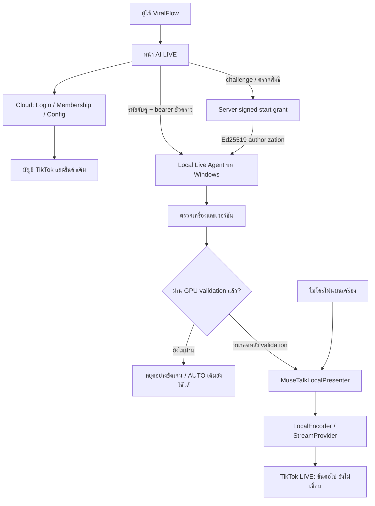

# AI LIVE — Local GPU architecture

AI LIVE อยู่ใน ViralFlow AI เดิม ใช้ผู้ใช้ บัญชี TikTok และสินค้าเดิม ค่าเริ่มต้นคือ `LOCAL_GPU`: งาน Presenter/เสียง/เข้ารหัสอยู่บน Windows ของลูกค้า ไม่มีการเลือก Cloud GPU หรือ MockPresenter แทนโดยเงียบ ๆ ระบบ Affiliate AUTO และ Content Posting เดิมไม่เปลี่ยนแปลง **LIVE-1 ยังไม่ complete และยังเริ่มไลฟ์จริงไม่ได้**

## สถานะจาก implementation

| สถานะ | ส่วนที่มีอยู่จริง | ขอบเขต |
| --- | --- | --- |
| `READY_WITHOUT_GPU` | Local API/handshake, hardware checker, compatibility gate, signed start authorization, customer UI, bootstrap manifest validation, session/queue/watchdog contracts และ tests | เป็น foundation ที่ทดสอบโดยไม่ใช้ GPU ได้ ไม่ใช่ Presenter จริง |
| `WAITING_FOR_GPU_VALIDATION` | MuseTalk incremental backend, audio/frame synchronization, local encoder, hardware performance และ signed installer distribution | ยังไม่เชื่อม/วัดบน NVIDIA จริง |
| `PRODUCTION_READY` | **false** | `AI_LIVE_REALTIME_VALIDATED=false`; ยังไม่มี real LIVE transport หรือ production installer |

## Cloud control / local media



Browser ติดต่อ `http://127.0.0.1:8766` โดยตรง เว็บไม่ส่งภาพ Presenter, PCM audio หรือ realtime frames ผ่าน cloud media proxy เดิมอีกแล้ว `/api/ai-live/health` ตอบว่าต้องใช้ local agent; legacy media endpoints ตอบ `410` และไม่ fetch worker แม้มี legacy config การขอ grant เท่านั้นที่ผ่าน cloud โดยไม่มี media

หน้า `/ai-live` อนุญาต CSP connect ไป loopback address เดียว และ microphone เฉพาะหน้านี้ สิทธิ์ของหน้าอื่นคงเดิม เบราว์เซอร์อาจขอ Local Network Access permission; ห้ามใช้ browser flags เพื่อข้าม security การเชื่อมจาก HTTPS ต้องทดสอบกับ browser ที่รองรับก่อนเผยแพร่จริง ([Chrome official Local Network Access](https://developer.chrome.com/blog/local-network-access))

## ขอบเขตของระบบ

- Cloud ใช้ `auth.getUser()` ตรวจผู้ใช้สด อ่าน `app_metadata.ai_live` ที่ server เป็นผู้กำหนด และตรวจ ownership ของ account/product ก่อนลงลายเซ็น ไม่อ่าน `user_metadata` เป็นสิทธิ์
- Agent จับคู่ด้วยรหัสใช้ครั้งเดียว bearer origin-bound อายุ 15 นาที อยู่ใน memory ต่ออายุ/หมุน token ก่อนหมดอายุ device UUID และ public verification key เป็นข้อมูลติดตั้ง ไม่เก็บ cloud access token/private signing key
- Start grant อายุไม่เกิน 120 วินาที ผูก owner/device/challenge/account/products/component versions และ grant ID ใช้ครั้งเดียว เป็น authorization สำหรับ **เริ่ม session** ไม่ใช่ heartbeat membership ระหว่าง stream สิทธิ์เปลี่ยนต้องตรวจใหม่เมื่อ Start ครั้งถัดไป ยังไม่มี active membership revocation service
- หนึ่งเครื่องมี active session ได้หนึ่งรายการ Start initialize worker ครั้งเดียว; Pause/Resume/Stop ตรวจ session owner Stop ไม่ติด gate เรื่องสิทธิ์หมดอายุหรือ hardware เมื่อ worker ขัดข้องมี recovery จำกัดหนึ่งครั้ง ถ้า Start grant ไม่สดแล้วต้อง Stop/release และขอ grant ใหม่ ไม่มี auto restart loop
- ไม่มี snapshot durable ข้ามการ restart ของ process ในรุ่นนี้ session/token เป็น memory shutdown พยายาม Stop และล้าง reference; การ recovery ผ่าน HTTP มีเฉพาะ session ที่ agent ยังถืออยู่ การจัดการ orphan worker หลัง process kill รอ real worker integration
- `PresenterProvider` เดิมมี chunk audio / receive frames / Stop / health / metrics; `MuseTalkLocalPresenter` ผูก boundary นี้สำหรับ incremental local backend ส่วน `MockPresenter` ใช้ automated tests เท่านั้น
- `WorkerBoundary`, `StreamProvider` และ `LocalEncoder` กำหนด lifecycle ที่ต้องต่อ real adapters รุ่นนี้ default เป็น unvalidated worker/encoder จึง fail closed ไม่เรียก cloud provider หรือสร้าง fake preview

## Domain foundation ที่ reuse

`LiveSessionController`, `CommentEngine`, `LiveBrainProvider`, `ProductBrain`, `ActionQueue`, `LivePipeline`, `LiveEventLog`, `Watchdog` และ Python `VoiceProvider` จาก non-GPU foundation คงอยู่ ใช้สินค้า/บัญชีเดิม ไม่สร้างฐานสินค้าใหม่

Internal test path:

```text
normalized comment → CommentEngine → LiveBrain → ProductBrain
  → ActionQueue → VoiceProvider → PresenterProvider
  → Event / Watchdog / session state
```

30-minute virtual-clock tests ตรวจ queue/event bounds, cancellation และ duplicate actions เป็น mock simulation เท่านั้น ไม่ใช่ 30-minute GPU benchmark หรือ TikTok LIVE broadcast

## Customer UI

แสดงบัญชี TikTok, ภาพ Presenter, สินค้า, ตรวจไมโครโฟนเริ่มต้น, สถานะเครื่อง, Start/Stop และตรวจสอบเครื่อง สถานะ local auto-update ทุก 4 วินาทีแบบไม่ซ้อนคำขอ

ภาพที่อัปโหลดเป็น **ภาพอ้างอิง ไม่ใช่ภาพสด** การตรวจไมโครโฟนขอ permission เมื่อผู้ใช้กดเท่านั้นและปิด audio tracks ทันที ไม่บันทึกหรือส่งเสียงออกจาก browser การรับเสียงจริงเข้าตัว Presenter ยังรอ NVIDIA integration Start ถูกปิดด้วย validation gate ทั้ง UI/client/agent แม้ hardware fixture ผ่าน

Customer projection เลือกเฉพาะสถานะ/เหตุผลภาษาไทยที่อนุญาต ไม่แสดง provider/model/ports/IDs/diagnostic payload ระบบ hardware raw diagnostics มีเฉพาะ local trusted developer call และไม่มี HTTP endpoint

## งานที่เหลือในขอบเขตถัดไป

1. NVIDIA จริง + incremental MuseTalk implementation ตาม [GPU validation checklist](AI_LIVE_GPU_VALIDATION.md)
2. Audio capture/encoder implementation และวัด synchronization, FPS/latency/VRAM/long-session stability
3. สร้าง signed Windows installer พร้อม managed runtime/dependencies, signed artifact hosting และติดตั้ง public key/device registration จริงตาม [Local Agent](AI_LIVE_LOCAL_AGENT.md)
4. เชื่อม trusted membership/device provisioning กับระบบสมาชิกเมื่อกำหนดนโยบาย device limit แล้ว; foundation นี้รับ interface เท่านั้น ไม่สร้างแพ็กเกจหรือ migration
5. LIVE transport/comments/RTMP/product pinning ต้องเป็นงานที่ได้รับอนุมัติแยกต่างหาก Content Posting scopes ไม่ได้ให้สิทธิ์ TikTok LIVE

ไม่มีการแตะ TikTok Production ที่ In Review, OAuth/scopes, Production env, AUTO, Product Radar, Creative Brain, Posting, Analytics หรือ Learning และไม่มี merge/deploy Production
