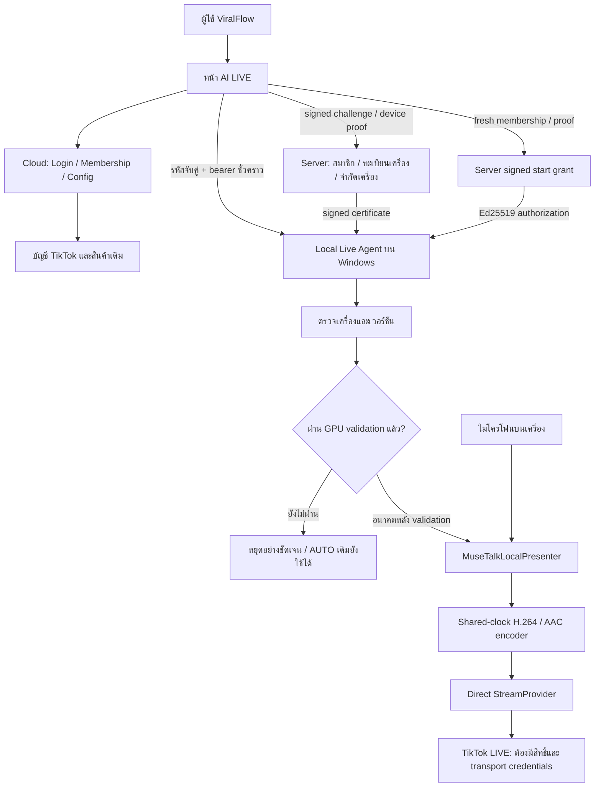
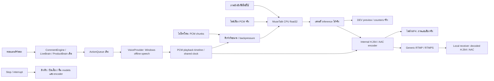

# AI LIVE — Local GPU architecture

## Local-first AI runtime — สถานะล่าสุด

เพิ่ม Brain/TTS บนเครื่องเข้ากับ Local Agent, LiveRoom, interrupt/resume และ encoder เดิม ดู [Local-first runtime](AI_LIVE_LOCAL_FIRST_RUNTIME.md) สำหรับ flow, signed product context, installer/license gates, resource profiles และ all-stage warmup ผล CPU Brain เป็น inference จริง ส่วน TTS ยังเป็น `LOCAL_TTS_MODEL_PENDING` เพราะ RAM/voice acceptance ไม่พร้อม จึงยังไม่ถือว่า LIVE-1 หรือ production realtime ผ่าน

หลักฐานเสียงระบบปฏิบัติการ/RTMP ในเอกสารเดิมด้านล่างเป็น proof ของรุ่นก่อน ไม่ใช่ผลยืนยัน Local TTS ปัจจุบัน ไม่มี silent fallback ไปเสียงนั้นใน local-first customer path ไม่มีการเปิด production validation flags หรือเปลี่ยน TikTok integration

## Digital Human foundation — รุ่น 0.5.0

งานต่อจาก Direct Streaming Core `9b29cda6f984b45f0372f598679fac0a92686607` และเก็บจุดย้อนกลับด้วย tag `ai-live-direct-stream-core-9b29cda` บน branch `feature/ai-live` ไม่มี merge/deploy Production และไม่เปลี่ยน TikTok OAuth/scopes/config หรือ Affiliate AUTO

รายละเอียด modules, ขอบเขต wiring และ NVIDIA benchmark อยู่ใน [Digital Human foundation](AI_LIVE_DIGITAL_HUMAN.md) ส่วนหลักฐาน CPU/A/V/RTMP สิบนาทีเดิมยังอยู่ใน [Direct Streaming](AI_LIVE_DIRECT_STREAMING.md) การเพิ่มโครงนี้ **ไม่ได้ทำให้ LIVE-1 complete**

| สถานะ | งานเพิ่มในรุ่นนี้ | ขอบเขตที่ยังไม่ผ่าน |
| --- | --- | --- |
| `READY_WITHOUT_GPU` | AvatarRenderer V2 boundary, PresenterPack/library ที่เข้ารหัส, gesture/quality guards, comment interruption, PCM safety buffer, isolated LiveRoom/policy, shared POST/LIVE contract, Control Room/คน LIVE | ผ่าน contract/integration tests; ไม่ใช่หลักฐานภาพเคลื่อนไหวบน GPU หรือหลายห้องจริง |
| `WAITING_FOR_GPU` | MuseTalk GPU, MuseTalk + FasterLivePortrait, Ditto และ Hybrid candidate adapters พร้อม dependency manifest/benchmark harness | ต้องต่อ upstream incremental backends, real layer/gesture sources และ quality detectors; ไม่ใช่แค่ใส่ GPU แล้วทุก adapter พร้อมทันที |
| `GPU_VALIDATION_REQUIRED` | harness 4 candidates × 1/2/3 rooms, measured-only capacity planner | ยังไม่มี NVIDIA benchmark; FPS/latency/VRAM/quality ที่ยังไม่วัดเป็น `null`, capacity `UNVERIFIED_CAPACITY` |

หน้า `/ai-live` มีห้องตามบัญชีและ Presenter Studio ผ่าน LocalLiveClient ที่จับคู่ไว้เดิม ค่า readiness/Start ยังคงผ่าน entitlement/device/compatibility/validation gates เดิม ไม่มี fallback mock ฝั่งลูกค้า ปัจจุบัน local agent ใช้ **managed child process pool แยกต่อห้อง** และเลือก session ตาม owner/account แล้ว แต่การรับห้องเพิ่มต้องผ่าน signed measured-capacity gate; ขาดหลักฐานเป็น `UNVERIFIED_CAPACITY` และ Start ถูกปิด ไม่มีการอ้างว่าหลายห้องบน native NVIDIA หรือ TikTok LIVE พร้อมใช้งาน production

ชื่อห้องและระยะเวลาใน UI เป็นแผนชั่วคราว ไม่ใช่ durable scheduling หรือ automatic Stop ปุ่มพูด/เปลี่ยนสินค้าระหว่าง LIVE ยังปิดไว้จนมี local execution endpoint จริง ค่า viewers/sales/units/ชั่วโมงสะสมไม่สร้างขึ้นเอง Presenter Studio เก็บภาพและ configuration ได้ แต่การผูกเสียง/gesture pack เข้า advanced runtime ยังรอ backend ที่ผ่าน validation

Component contract เพิ่มเป็น `0.5.0` ทั้ง web/agent/worker และ installer source ต้อง build/เซ็น/เผยแพร่ release ใหม่ผ่านช่องทางเดิมก่อนส่งลูกค้า ไม่มีการอ้างว่า installer รุ่นใหม่เผยแพร่แล้ว

## Multi-Account Control Center และ native runtime pool

งานต่อจาก `1cfc25540990258a1920dcb882c5126c00f0f4a1` เพิ่ม `/home`, `/post`, `/post/[id]`, navigation ของลูกค้าและ shared performance-event projection โดย reuse auth/accounts/products/AUTO/publishing/analytics เดิม รายละเอียดข้อมูลจริง, snapshot deltas, สกุลเงิน, active-owner-run limit ของ POST และผลตรวจอยู่ใน [Multi-Account Control Center](MULTI_ACCOUNT_CONTROL_CENTER.md)

`ManagedRuntimeWorker` มี process/job และ inherited command channel แยกต่อ room; child แต่ละตัวใช้ `LocalWorkerBoundary` เดิม แยก owner/session routes ของ Start/Pause/Resume/Stop/recovery/audio/preview และจำกัด duplicate account lifecycle ห้องหนึ่ง timeout/crash ไม่ได้สั่งหยุดอีกห้อง การรับ session ใหม่ยังอยู่หลัง authentication, signed grant, entitlement, compatibility, validation และ measured capacity ของ Local Agent

Capacity evidence ผูก owner/device/component versions/hardware fingerprint และ expiry ด้วย trusted signature ค่า browser หรือชื่อ GPU เปิด concurrency ไม่ได้ Test-only capacity injection อยู่ใน tests เท่านั้น ไม่ติดตั้ง evidence ปลอมให้ลูกค้า Native NVIDIA 1/2/3-room A/V/FPS/latency/resource/receiver/reconnect/Stop-release benchmark ยัง pending จึงไม่เปิด LIVE-1 gate

Pool นี้แยก generic transport lifecycle แต่ destination config ยังเป็น generic managed configuration เดิม ไม่มี official per-account TikTok LIVE channel/credential routing Speak Now/Change Product และ real platform comment/voice-action execution ยังไม่พร้อมและ UI ยังปิดไว้ ภาพอ้างอิง/configuration หรือ mock test ไม่ถูกนำไปอ้างว่า real presenter broadcast สำเร็จ

AI LIVE อยู่ใน ViralFlow AI เดิม ใช้ผู้ใช้ บัญชี TikTok และสินค้าเดิม ค่าเริ่มต้นคือ `LOCAL_GPU`: งาน Presenter/เสียง/เข้ารหัสอยู่บน Windows ของลูกค้า ไม่มีการเลือก Cloud GPU หรือ MockPresenter แทนโดยเงียบ ๆ ระบบ Affiliate AUTO และ Content Posting เดิมไม่เปลี่ยนแปลง **LIVE-1 ยังไม่ complete และยังเริ่มไลฟ์จริงไม่ได้**

## สถานะจาก implementation

การส่งมอบรุ่น `0.4.0` ใช้ **ViralFlow AI โปรแกรมเดียว**: installer รวม local runtime/encoder และเตรียม presenter dependencies/models ด้วย signed managed downloads ไม่มี manual Python/CUDA/PATH/OBS ขั้นตอน first-run, download resume, repair, rollback และ release gates อยู่ใน [One App Installation](AI_LIVE_INSTALLATION.md) ยังไม่มี signed customer release channel และยังไม่ผ่าน NVIDIA validation

| สถานะ | ส่วนที่มีอยู่จริง | ขอบเขต |
| --- | --- | --- |
| `READY_WITHOUT_GPU` | Local API/handshake, compatibility gate, Windows installer พร้อม runtime, signed update distribution/rollback, persistent device registration/revoke/limit, key rotation/entitlement, customer UI และ bounded domain tests | registry apply แล้วบน project เดิม; installer ยังไม่เซ็น Authenticode และยังไม่เปิด production enrollment/update channel |
| `WAITING_FOR_GPU` / `GPU_VALIDATION_REQUIRED` | MuseTalk GPU backend และ NVIDIA NVENC ผ่าน encoder contract เดียวกับ software H.264 | ยังไม่เชื่อม/วัดบน NVIDIA จริง |
| `PRODUCTION_READY` | **false** | `AI_LIVE_REALTIME_VALIDATED=false`; direct RTMP ผ่าน local DEV proof แล้ว แต่ยังไม่มี TikTok LIVE credentials, signed production distribution หรือ production enrollment ที่เปิดใช้งานแล้ว |
| `DEV_PROOF_OF_FLOW` | MuseTalk CPU float32, เสียงภาษาไทย SAPI จริง, generated JPEG, shared-clock H.264/AAC encoder และ direct RTMP receiver | วัดผ่าน `LocalWorkerBoundary` ต่อเนื่อง 600.086 วินาที พร้อม receiver live fMP4 player ก่อน/หลัง reconnect ใน producer session เดียว; ไม่ใช่ GPU validation หรือสิทธิ์เริ่มไลฟ์จริง ดู [ผล direct streaming](AI_LIVE_DIRECT_STREAMING.md) |

## Cloud control / local media



Browser ติดต่อ `http://127.0.0.1:8766` โดยตรง เว็บไม่ส่งภาพ Presenter, PCM audio หรือ realtime frames ผ่าน cloud media proxy เดิมอีกแล้ว `/api/ai-live/health` ตอบว่าต้องใช้ local agent; legacy media endpoints ตอบ `410` และไม่ fetch worker แม้มี legacy config การขอ grant เท่านั้นที่ผ่าน cloud โดยไม่มี media

หน้า `/ai-live` อนุญาต CSP connect ไป loopback address เดียว และ microphone เฉพาะหน้านี้ สิทธิ์ของหน้าอื่นคงเดิม เบราว์เซอร์อาจขอ Local Network Access permission; ห้ามใช้ browser flags เพื่อข้าม security การเชื่อมจาก HTTPS ต้องทดสอบกับ browser ที่รองรับก่อนเผยแพร่จริง ([Chrome official Local Network Access](https://developer.chrome.com/blog/local-network-access))

## ขอบเขตของระบบ

- Cloud ใช้ `auth.getUser()` ตรวจผู้ใช้สด อ่าน `app_metadata.ai_live` ที่ server เป็นผู้กำหนด และตรวจ ownership ของ account/product ก่อนลงลายเซ็น ไม่อ่าน `user_metadata` เป็นสิทธิ์
- Agent จับคู่ด้วยรหัสใช้ครั้งเดียว bearer origin-bound อายุ 15 นาที อยู่ใน memory ต่ออายุ/หมุน token ก่อนหมดอายุ UUID และ Ed25519 identity ต่อ installation เก็บแบบ Windows current-user DPAPI; ไม่มี plaintext private key/cloud token การลงทะเบียนใช้ proof-of-possession ไม่ใช่ hardware attestation
- ทะเบียนเครื่องจริงอยู่ใน server-only RLS tables; registration ตรวจสมาชิกสด/เจ้าของ/nonce/จำนวนเครื่องแบบ atomic; revoke บล็อก grant ใหม่ทันที และ signed revoke receipt หยุด session ของเครื่องนั้นเมื่อ local agent ได้รับ ไม่อ้างว่า remote revoke หยุดเครื่อง offline ได้ทันที
- Signed grant อายุไม่เกิน 120 วินาที ผูก owner/device/challenge/account/products/component versions และ grant ID ใช้ครั้งเดียว ใช้ตรวจสิทธิ์ตอนเริ่ม session หรือเปิด native transport settings ไม่ใช่ heartbeat membership ระหว่าง stream สิทธิ์เปลี่ยนต้องตรวจใหม่เมื่อ Start ครั้งถัดไป ยังไม่มี active membership revocation service
- หนึ่งบัญชีมี active local session ได้หนึ่งรายการ; จำนวนห้องต่อเครื่องต้องมี signed measured capacity ที่ยังถูกต้อง Managed worker pool initialize child แยกต่อ room; Pause/Resume/Stop ตรวจ session owner และ route ให้ห้องที่เลือก Stop ไม่ติด gate เรื่องสิทธิ์หมดอายุหรือ hardware เมื่อ worker ขัดข้องมี recovery จำกัดหนึ่งครั้ง ถ้า Start grant ไม่สดแล้วต้อง Stop/release และขอ grant ใหม่ ไม่มี auto restart loop
- ไม่มี snapshot durable ข้ามการ restart ของ process ในรุ่นนี้ session/token เป็น memory shutdown พยายาม Stop และล้าง reference; การ recovery ผ่าน HTTP มีเฉพาะ session ที่ agent ยังถืออยู่ Managed worker process ใช้ Windows job object ปิดเฉพาะ worker/descendants ของตนเมื่อ parent ปิดหรือ timeout มี native ownership test แต่ยังไม่แทน long-session GPU validation
- `PresenterProvider` เดิมมี chunk audio / receive frames / Stop / health / metrics; `MuseTalkLocalPresenter` ผูก boundary นี้สำหรับ incremental local backend ส่วน `MockPresenter` ใช้ automated tests เท่านั้น
- `LocalWorkerBoundary` เชื่อม real presenter/audio, shared-clock encoder และ direct provider แล้ว; DEV proof ใช้ media boundary เดียวกับ customer local agent และมี producer session เดียว software H.264/AAC กับ Generic RTMP ผ่าน receiver/player proof ก่อนและหลัง reconnect ส่วน GPU/NVENC และ production release ยังไม่ผ่าน acceptance จึง fail closed ไม่เรียก cloud provider หรือสร้าง fake preview

## Domain foundation ที่ reuse

`LiveSessionController`, `CommentEngine`, `LiveBrainProvider`, `ProductBrain`, `ActionQueue`, `LivePipeline`, `LiveEventLog`, `Watchdog` และ Python `VoiceProvider` จาก non-GPU foundation คงอยู่ ใช้สินค้า/บัญชีเดิม ไม่สร้างฐานสินค้าใหม่

Internal test path:

```text
normalized comment → CommentEngine → LiveBrain → ProductBrain
  → ActionQueue → VoiceProvider → PresenterProvider
  → Event / Watchdog / session state
```

30-minute virtual-clock tests ตรวจ queue/event bounds, cancellation และ duplicate actions เป็น mock simulation เท่านั้น ไม่ใช่ 30-minute GPU benchmark หรือ TikTok LIVE broadcast

## Customer UI

หน้าปกติแสดงบัญชี TikTok, Presenter, สินค้า, ไมโครโฟน, Preview, START LIVE, STOP LIVE และสถานะ ความพร้อม/สมาชิก/ลงทะเบียน/ยกเลิกเครื่อง/อัปเดต/ซ่อมแซมอยู่ใน “ตั้งค่าการ LIVE” ที่ปิดไว้ก่อน ดึงสถานะ local กับสิทธิ์สมาชิกจาก server ทุก 4 วินาทีแบบไม่ซ้อนคำขอ การติดตั้งต้องยืนยัน หยุด session และผ่าน signature/hash/trusted-download checks ไม่ใช้สถานะ browser เป็นสิทธิ์สมาชิก

ภาพที่อัปโหลดเป็น **ภาพอ้างอิง ไม่ใช่ภาพสด** จนมี generated JPEG จาก owner-checked local session; frame path มี bearer ใน header, จำกัด 4 MiB, poll ไม่ซ้อนและคืน Blob URL เมื่อเปลี่ยน/Stop/unmount ภาพจริงใช้ป้าย “ภาพจากระบบ” ไม่อ้างว่า TikTok LIVE การตรวจไมโครโฟนขอ permission เมื่อผู้ใช้กดเท่านั้นและปิด audio tracks ทันที ไม่บันทึกหรือส่งเสียงออกจาก browser Preview และ Start ยังถูกปิดด้วย production validation gate แม้ hardware fixture ผ่าน การตั้งค่า transport เปิด native dialog ผ่าน signed owner/account/device grant และเก็บ credential แบบ DPAPI บนเครื่อง; browser ไม่รับ URL/key

Customer projection เลือกเฉพาะสถานะ/เหตุผลภาษาไทยที่อนุญาต ไม่แสดง provider/model/ports/IDs/diagnostic payload ระบบ hardware raw diagnostics มีเฉพาะ local trusted developer call และไม่มี HTTP endpoint

## DEV proof ที่ไม่มี NVIDIA

เมื่อ `AI_LIVE_DEV_FALLBACK=true` และ `PRESENTER_PROVIDER=dev_fallback` บน local development เท่านั้น หน้า `/ai-live` เพิ่มเครื่องมือทดลองแยกจาก customer console เดิม มี reference, local audio, microphone, Start/Stop, generated frames และค่าที่วัดจริง `/api/ai-live/dev/*` ตรวจ flag ก่อนตอบ, ตรวจ `auth.getUser()` และกำหนด owner จาก session ฝั่ง server แล้วจึงส่งไป worker ที่ loopback; ไม่มี worker bearer ใน browser หรือ URL ของ client

`NODE_ENV`, `APP_ENV`, `AI_LIVE_ENV` หรือ `VERCEL_ENV` เป็น production หรือมี `VERCEL` จะปิดโหมดนี้ แม้เปิด flag ไว้ การปิด flag คง `GPU_REQUIRED` เดิม ไม่สลับเป็น mock เมื่อ dependency/model/hardware ไม่พร้อม Worker ทุก media request ยังตรวจ bearer และ session owner โหมดนี้ไม่ได้เปิด membership enrollment, start grant หรือ production LIVE gate



ภาพไม่ได้มาจาก prerecorded loop; inference ส่งแต่ละ JPEG ก่อนมีไฟล์สำเร็จ และ direct receiver รับภาพ/เสียงระหว่าง producer ทำงาน เสียง SAPI สร้าง WAV ชั่วคราวแล้วส่ง PCM chunks ผ่าน VoiceProvider เดิม จึงไม่อ้างว่าเป็น streaming speech synthesis เสียง playback เข้า encoder โดยไม่รอ neural queue; เมื่อ CPU ช้า encoder hold เฟรมจริงล่าสุดเพื่อเดิน timeline ต่อ ไม่สร้าง fake lip-sync frame และนับ held frames แยกจาก inference

[หลักฐานที่เก็บไว้](AI_LIVE_DIRECT_STREAMING_PROOF.json) วัด 600.086 วินาทีผ่าน `LocalWorkerBoundary` เดียวกับ customer media path: real frames 233, held frames 14,795, presenter 0.385 FPS, latency median/p95 9.766/15.907 วินาที, encoder 15,028 frames ที่ 25.000 FPS และ bitrate encoder/transport 304.859/302.600 kbps Mux drift final/max 16/64 ms และ input-clock drift 0 ms เป็น packet synchronization เท่านั้น ไม่ใช่ realtime phoneme/lip sync Audio buffer สูงสุด 6,855 ms; inference branch ทิ้ง 177 chunks แต่ encoded playback PCM ไม่ทิ้ง sample ส่วน transport ทิ้ง 12 tags รวม 4 audio tags ระหว่าง startup/reconnect

คิวสูงสุด comment/action/presenter/encoder/transport เท่ากับ 1/2/4/0/6 และ RAM หลัง warmup อยู่ 4,345.1–4,352.6 MiB; first warm/last running samples เท่ากับ 4,348.8/4,345.9 MiB Receiver มี 608 progress samples ครอบคลุม 601.719 วินาที และ progress gap สูงสุด 2.547 วินาที ทั้งสอง recordings decode H.264/AAC ตลอดไฟล์ได้จริง รวม A/V span 602.888 วินาที โดย timestamp เป็น monotonic และ receiver drift สูงสุด 48 ms มี injected reconnect หนึ่งครั้งใน producer session เดิม Stop รายงานคืน resource ปิด worker/receiver และ RAM หลัง Stop 752.7 MiB

Receiver live player อ่าน fragmented MP4 จาก RTMP ที่รับอยู่ระหว่าง producer ทำงาน ไม่ replay ไฟล์ที่เสร็จแล้ว Browser เก็บ 588 observations และรับ 1,206 fragments โดย cache สูงสุด 706,935 bytes ก่อน/หลัง reconnect decode video 1,900/12,763 frames และ audio 297,591/1,715,138 bytes; playback time เดินต่อ 75.469/510.009 วินาที ทั้งสองช่วงเปิดเสียง มี audio RMS ที่ไม่เป็นศูนย์ และ player errors 0 คอมเมนต์จำลอง 51 รายการถูกยอมรับและ duplicate 51 รายการถูกปฏิเสธ; Voice calls 51 ครั้งส่ง PCM 8,417,760 bytes ผ่าน domain pipeline เดิม

คอมเมนต์และสินค้าใน proof เป็น existing TEST fixtures; Voice และ Presenter เป็นของจริง การสลับ `PRESENTER_PROVIDER=musetalk` และ encoder ไป NVENC ใช้ contract เดิม แต่ต้องผ่าน NVIDIA validation ค่า config อย่างเดียวไม่รับรอง CUDA/FPS/lip sync RTMP local ผ่านแล้ว ส่วน TikTok LIVE ไม่ได้ทดสอบและยังไม่มี transport credentials

## งานที่เหลือในขอบเขตถัดไป

1. NVIDIA จริง + incremental MuseTalk implementation ตาม [GPU validation checklist](AI_LIVE_GPU_VALIDATION.md)
2. ตรวจ audio capture, lip sync, FPS/latency/VRAM และ long-session stability บน NVIDIA; software H.264/AAC clock, local RTMP proof สิบนาที และ bounded isolated CLI helper shutdown มีหลักฐานแล้ว
3. เซ็น Authenticode และเผยแพร่ installer/update artifacts ผ่านช่องทางที่เชื่อถือได้; เพิ่ม trusted public verification key ใน release build ตาม [Local Agent](AI_LIVE_LOCAL_AGENT.md)
4. Registry migration `20261001091106_ai_live_device_registration.sql` apply แล้วครั้งเดียว แต่ยังต้อง configure server-only signer และ provision `app_metadata.ai_live` ด้วย trusted membership system ไม่มีการสร้างสิทธิ์สมาชิกปลอมหรือ billing flow ใหม่ ดู [Server Activation](AI_LIVE_SERVER_ACTIVATION.md)
5. สิทธิ์และ transport credentials ของ TikTok LIVE, real platform comments และ product pinning ยังต้องต่ออย่างได้รับอนุญาต; Generic RTMP/RTMPS เป็น internal provider แล้ว Content Posting scopes ไม่ได้ให้สิทธิ์ TikTok LIVE

ผล TypeScript suite ยังมี unrelated scheduler test ล้มเหลวเพราะ `vercel.json` เป็น `{}` ตามการถอด scheduler สำหรับ Hobby จึงไม่อ้างว่า tests ทั้งชุดผ่าน

ไม่มีการแตะ TikTok Production ที่ In Review, OAuth/scopes, Production env, AUTO, Product Radar, Creative Brain, Posting, Analytics หรือ Learning และไม่มี merge/deploy Production
