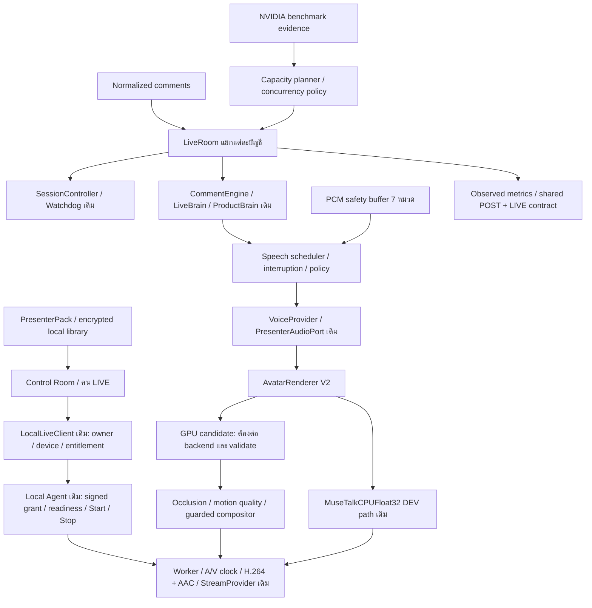

# AI LIVE — Digital Human foundation

สถานะ: `READY_WITHOUT_GPU` เฉพาะ foundation; renderer/hardware เป็น `WAITING_FOR_GPU` / `GPU_VALIDATION_REQUIRED` **ไม่ใช่ LIVE-1 complete หรือ production release**

Baseline: `9b29cda6f984b45f0372f598679fac0a92686607`; backup tag: `ai-live-direct-stream-core-9b29cda`; branch: `feature/ai-live`; component contract: `0.5.0`

## เส้นทางที่ reuse



กราฟแสดงขอบเขตและ ports; ไม่ได้แปลว่าทุกลูกศรเปิด production แล้ว ปัจจุบัน local runtime มี managed child process แยกต่อห้องและ owner/account routing แล้ว แต่ physical NVIDIA concurrency, advanced renderer, real platform comments และ official TikTok LIVE transport ยังต้องต่อ/พิสูจน์ ระบบไม่มี private TikTok API และไม่ใช้ OBS/TikTok Studio

## Modules และข้อจำกัด

| Module | สิ่งที่ทำได้แล้ว | สิ่งที่ยังต้องพิสูจน์/ต่อ |
| --- | --- | --- |
| `AvatarRenderer` / `AvatarFrameEngine` | load/audio/frame/gesture/health/metrics/interrupt/stop; ต่อ JPEG เข้า `FrameEngine` boundary เดิม; เลือก renderer ชัดเจน | GPU incremental backend จริงและ cancellation ที่คืน native resources ได้ |
| MuseTalk Hybrid | compositor ของ mouth/head/expression/body layers; ใช้ observed registration/quality; ปฏิเสธ unguarded backend | source layers จริง, alignment และ detectors บน NVIDIA |
| FasterLivePortrait | dependency/source/model detection และ motion capability gate | pinned compatible runtime/engines, actual streaming layer bridge; ไม่อ้าง full-body |
| Ditto | candidate interface, dependency manifest, benchmark entry | เปลี่ยน upstream completed-file writer เป็น bounded incremental frame sink; ไม่ replay MP4 |
| `PresenterPack` / Presenter library | identity/reference/neutral/expression/gestures/voice/fallback/compatibility; owner-bound local CRUD | voice label เป็น configuration ไม่ใช่หลักฐานเสียง; renderer pack attachment ต้องผ่าน GPU path |
| `GestureEngine` | 10 gestures: neutral, smile, nod, small_wave, open_palm, point_product, hold_product, light_hair_touch, laugh_reaction, listening_pose; intent/emphasis/cooldown/probability/repetition/neutral recovery | real gesture assets/motion sources และ measured supported capabilities |
| `OcclusionGuard` / `MotionQualityGuard` | face/mouth/eyes/product overlap, confidence, face/lip/hand/freeze/motion/temporal checks; advanced → safe → neutral; last real frame fallback | detector observations ต้องมาจาก actual frames; ไม่มี hardcoded quality score เพื่อเปิด production |
| Speech scheduler | priority safety > product question > purchase > greeting > general > filler; no overlapping voice lease; script PCM cursor resume ไม่ส่ง chunk เดิมซ้ำ | actual upstream voice cancellation/ack latency บน hardware |
| `SafetyVoiceBuffer` | prewarm ผ่าน VoiceProvider เดิมครบ 7 หมวด: introduction/features/CTA/FAQ/filler/engagement/transition; bounded PCM, timeout fallback, remaining/fallback/dead-air metrics | ต้องมี actual approved product text/voice และ audio delivery observations; exhausted buffer ไม่วนไม่จำกัด |
| `LiveRoomRegistry` / managed room pool | owner/account isolation; child process และ presenter/audio/encoder/stream lifecycle ต่อห้อง; duplicate protection; pause/resume/stop/preview ตามห้อง, watchdog, ambiguous-start lease retained จน Stop ยืนยัน | physical NVIDIA concurrency ยังไม่ benchmark; ไม่มี signed measured capacity ที่ตรงเครื่องจะห้าม Start; generic config ไม่ใช่ per-account TikTok LIVE transport |
| Policy | disclosure/platform/region/product/claim/identity guards ก่อนส่งเสียง | official policy/region configuration และ transport eligibility ต้องได้จริง; ไม่มี anti-detection/bypass |
| Analytics contract | account/post/live/clip/views/sales/units/commission/revenue/hour/top product shape สำหรับ Learning เดียวกัน; unavailable เป็น `null` | ไม่แก้ POST analytics หรือ invent LIVE observations |

`GuardedHybridFrameEngine` ตรวจ occlusion ก่อนเรียก motion source และตรวจ layer quality ก่อน JPEG ไป encoder ถ้า fallback ไม่มีเฟรมจริงที่ใช้ได้ จะ reject แทนสร้างภาพปลอม V2 เก็บ source PTS/held provenance; existing encoder ยังคง hold latest real frame ตาม clock เดิม

## Customer Control Room / คน LIVE

- `/ai-live` อ่านบัญชี/สินค้า/หมวดจากข้อมูลเดิม มี `auth.getUser()` และ owner filter; ไม่ส่ง token/scopes/provider diagnostics ไป UI
- การ์ดบัญชีแสดงความพร้อม/สถานะ/ภาพ/คน LIVE/สินค้า/เวลาและ metrics ที่มี observation จริงเท่านั้น บัญชีขาดการเชื่อมมี CTA ไปเชื่อมใหม่
- Open Room มี title/account/category/presenter/products/duration/preview/check readiness; title/duration เป็น planning draft เท่านั้น
- Start/Stop/Pause/Resume ใช้ paired LocalLiveClient เดิม ไม่ remount controller หรือสร้าง mock session path
- คน LIVE เพิ่ม/แก้/ลบ/กำหนดบัญชี/ดูภาพและเลือก reference ได้ รูปเป็น **ภาพอ้างอิง** จนมี real generated frame ภาพ thumbnail โหลดด้วย authenticated header และคืน Blob URL เมื่อเลิกใช้
- ค่าความพร้อมของ library หมายถึง configuration ครบ ไม่ใช่ renderer/voice/stream ผ่าน Start ยังคงใช้ machine entitlement/validation gates จริง
- พูดทันทีและเปลี่ยนสินค้าระหว่าง LIVE ปิดไว้ เพราะยังไม่มี local execution endpoint จริง ชื่อ engine, ports, keys, internal IDs และ debug payload ไม่แสดง
- Local session ที่ recovery ใช้ account identity ที่ agent ยืนยัน ไม่ติดป้ายตามบัญชีที่ผู้ใช้เพิ่งเลือก

## Presenter storage/security

`/v1/presenters` และ reference/delete routes อยู่ใน loopback Local Agent เดิม ตรวจ origin-bound pairing token + signed device certificate owner ทุกคำขอ เก็บ metadata/reference แบบ AES-256-GCM โดย key ถูก Windows current-user DPAPI ป้องกัน แยกไฟล์ตาม owner, authenticated AAD, atomic replace, จำกัด 20 packs/4 MiB ต่อภาพ; ไม่มี plaintext secret/image library

ไม่มี URL token หรือ filesystem path จากลูกค้า reference binary ใช้ no-store/nosniff และ MIME/size checks ลบ pack ระหว่าง active session ถูกปิดไว้ Uninstall/cleanup อยู่ใต้ managed `references/library` เดิม การมี assigned account IDs ใน configuration ไม่ถือเป็นสิทธิ์เริ่ม session; signed grant เดิมยังตรวจ ownership สด

## NVIDIA harness และ measured-only capacity

```powershell
python workers/ai-live/renderer_benchmark.py --candidate musetalk_gpu --rooms 1 --reference C:/bench/presenter.jpg --audio C:/bench/voice.wav --output C:/bench/musetalk-gpu-1 --seconds 600
```

ใช้ runtime ที่ installer จัดการเมื่อพร้อม เปลี่ยน candidate เป็น `musetalk_portrait`, `ditto`, `musetalk_hybrid` และ rooms เป็น `1`, `2`, `3` รวม 12 plans เสียงต้องเป็น mono PCM16 16 kHz และภาพต้องมีสิทธิ์ใช้งาน ไม่มี automatic model download ใน harness

บน host ปัจจุบันทั้ง 12 plans ให้ `NOT_RUN` / `GPU_REQUIRED`, ไม่มีการเปิด media/output หรือโหลดโมเดล จึงไม่มี measured GPU score ค่า performance/quality เป็น `null` และ capacity `UNVERIFIED_CAPACITY`

Harness ส่ง incremental frames/audio ผ่าน `AVSessionStream`/encoder/StreamProvider เดิม แยก resources ต่อ room, คิว bounded และ stop ที่ไม่คืน resource รายงานผิดพลาด ไม่บันทึกว่า release สำเร็จ Native GPU inference ที่ค้างยังต้องพิสูจน์ process isolation/cancellation บนเครื่องจริง

ก่อนเพิ่ม concurrency ต้องมี evidence ของแต่ละจำนวนห้องแยกกัน >=600 วินาที ผูก fingerprint GPU/driver/renderer/runtime, FPS, p50/p95 latency, RAM/VRAM/GPU usage, encoder latency, A/V drift, receiver A/V, lip-sync, occlusion/gesture failures, dropped frames, reconnect, queue/crash counts และ Stop/release

Metric ที่ encoder/detector/receiver ยังไม่ส่งกลับเป็น `null` ไม่คำนวณจากความรู้สึก Capacity planner ไม่ใช้ชื่อ GPU เดาความจุ และไม่รับ larger-room evidence แทน one-room baseline โดยอัตโนมัติ

แหล่ง upstream ที่ใช้เตรียม candidate contract: [MuseTalk inference](https://github.com/TMElyralab/MuseTalk/blob/main/inference.sh), [FasterLivePortrait](https://github.com/warmshao/FasterLivePortrait/blob/master/README.md), [Ditto online pipeline](https://github.com/antgroup/ditto-talkinghead/blob/main/stream_pipeline_online.py) Manifest เป็น planning/detection เท่านั้น ต้อง pin/review model licenses/sign release artifacts ก่อนดาวน์โหลดให้ลูกค้า

## Verification รุ่น Digital Human ก่อน Multi-Account Control Center

- AI LIVE TypeScript suite: room isolation, owner checks, pack validation, priority interruption/PCM resume, real-buffer preparation/fallback, audio ambiguity/recovery, lifecycle, watchdog, policy, UI projection และ paired presenter CRUD
- Python suite: renderer factory/guard boundary, capability gate, gestures, occlusion/fallback, measured-only capacity, benchmark no-GPU behavior, encrypted presenter persistence/owner isolation/loopback HTTP รวม regression worker/streaming เดิม
- Browser visual proof ใช้ component จริงใน isolated internal fixture ที่ระบุว่าเป็นข้อมูลทดสอบ; desktop 1440/mobile 390 ไม่มี horizontal overflow และ Start ปิดเมื่อไม่มีส่วนเสริม ไม่มี fake LIVE หรือภาพ presenter ใช้แทน inference
- Preview นี้ไม่ใช่ authenticated production E2E หรือ NVIDIA/media benchmark ไม่มีการ publish/paid API call/deploy
- รัน typecheck/lint/production build; warnings เดิมนอก AI LIVE แยกจาก regression ไม่มี broad refactor

ผลตรวจสุดท้าย: TypeScript AI LIVE **179/179** (31 files), Python **302 ผ่าน / 2 opt-in skips** (304 tests), `pnpm typecheck` และ `pnpm build` ผ่าน; `pnpm lint` ไม่มี errors โดยมี 8 warnings เดิมใน video benchmark/fal tests ไม่มี warnings ในไฟล์ AI LIVE ที่เพิ่ม Browser fixture: viewport/document width 1440/1440 และ 390/390, reconnect CTA/คน LIVE เปิดได้, captured application errors 0 การตรวจนี้ไม่เปิด GPU gate หรือ production LIVE

## งานที่เหลือก่อนใช้จริง

1. ต่อ/ตรวจ GPU incremental backends, gesture sources, measured occlusion/quality detectors และ pack/voice runtime binding
2. Benchmark NVIDIA จริงครบ 4 candidates × 1/2/3 rooms; validate lip sync, motion, A/V, reconnect, resource release และ capacity
3. พิสูจน์ managed multi-room child processes บน native NVIDIA จริงหลัง signed capacity gate และต่อ real comment/voice/action endpoints; customer agent มี pooled room routing แล้ว แต่ยังไม่อ้างว่า hardware concurrency หรือ official per-account TikTok LIVE transport ผ่าน
4. Build/เซ็น/เผยแพร่ `0.5.0` ผ่าน signed distribution และ provision membership/device/signing infrastructure เดิม
5. TikTok LIVE ใช้ได้เมื่อมี official eligibility/transport credentials จริงเท่านั้น Content Posting approval ไม่ใช่ LIVE authorization

## อัปเดต Multi-Account Customer Control Center

Home/POST หลายบัญชี, measured-only local room capacity และ managed child process pool ถูกเพิ่มใน branch เดิม ดู [รายละเอียดและข้อจำกัดรอบนี้](MULTI_ACCOUNT_CONTROL_CENTER.md) คำว่า pooled rooms หมายถึง lifecycle/routing ที่แยกกันและผ่าน contract tests ไม่ใช่ผล benchmark ว่าเครื่องปัจจุบันเริ่มหลาย LIVE ได้จริง Capacity ที่ยังไม่วัดเป็น `UNVERIFIED_CAPACITY` และ Start ถูกปิด; ปุ่มพูด/เปลี่ยนสินค้าระหว่าง LIVE ยังไม่เปิดจนมี execution endpoint จริง
