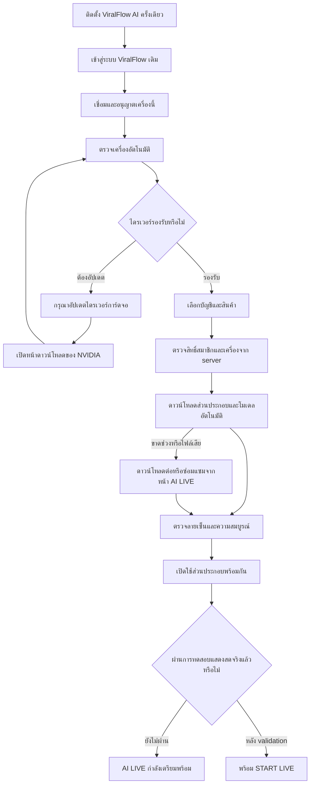

# ViralFlow AI — One App Installation

สถานะ 2026-10-02 บน `feature/ai-live`: ตัวติดตั้ง Windows และระบบจัดการส่วนประกอบพร้อมสำหรับทดสอบการส่งมอบ ส่วนช่องทางแจกจ่ายที่ลงลายเซ็นและการทดสอบ NVIDIA จริงยังต้องทำก่อนเปิดใช้งานลูกค้า ไม่ประกาศ `LIVE-1` complete และไม่ deploy Production

## ประสบการณ์ผู้ใช้

ติดตั้ง **ViralFlow AI เพียงโปรแกรมเดียว** จากนั้นเปิดไอคอน ViralFlow AI และเข้าสู่ระบบเดิม หน้า `/ai-live` ใช้บัญชี TikTok และสินค้าเดิม ผู้ใช้ไม่ต้องติดตั้ง Python, FFmpeg, MuseTalk, OBS หรือ TikTok Studio ไม่ต้องใช้ terminal, pip, PATH หรือ CUDA Toolkit แยก

การเตรียมส่วนประกอบอัตโนมัติเริ่มหนึ่งครั้งเมื่อจับคู่/อนุญาตเครื่อง ตรวจสมาชิก และเลือกบัญชี/สินค้าครบแล้ว ใช้สิทธิ์ระยะสั้นจาก server เดียวกับ AI LIVE เดิม ไม่มี local-only membership bypass ไม่มีการสร้างบัญชีหรือสินค้าใหม่เพื่อทำให้ดูพร้อม

หากการดาวน์โหลดขาดช่วง ผู้ใช้กด “เตรียมเครื่อง” อีกครั้งได้ ระบบรับต่อจาก prefix ที่ตรวจความสมบูรณ์แล้ว ไม่วน retry อัตโนมัติไม่จำกัด ความคืบหน้าใช้จำนวนไบต์ที่รับจริง การตรวจ/ติดตั้งแสดงสถานะไม่แต่งเปอร์เซ็นต์

## สิ่งที่รวมและสิ่งที่ดาวน์โหลด

| ส่วนประกอบ | วิธีส่งมอบ | สถานะจริง |
|---|---|---|
| ตัวติดตั้งและ maintenance GUI | รวมใน `ViralFlow-AI-Setup-0.4.0.exe` | Install/Update, Repair, Uninstall แบบไม่ใช้ terminal |
| Local Agent, private Python/Tk runtime, security libraries | รวมในตัวติดตั้ง | ไม่ค้นหา/ติดตั้ง Python ของผู้ใช้ |
| FFmpeg, audio runtime และ notices | รวมในตัวติดตั้ง | encoder capability/import self-test ไม่ใช่ GPU performance validation |
| AI worker, domain interfaces, encoder/stream integration | รวม source และ boundary ในแพ็กเกจ | worker ที่ใช้ dependencies ขนาดใหญ่ทำงานใน private process |
| Presenter runtime และ dependencies | `runtime` archive จากช่องทาง signed release | publisher เตรียม portable Python และ offline wheels ที่ pin version/SHA-256 ไว้ล่วงหน้า ลูกค้าไม่รัน pip |
| MuseTalk, VAE, Whisper และ assets ของโมเดลที่จำเป็น | `models` archive ใน first run | ตรวจโมเดลที่ต้องมีก่อนสร้าง archive ไม่รวมไฟล์ขนาดใหญ่ใน Git/ตัวติดตั้งพื้นฐาน |
| NVIDIA user-space runtime | อยู่ใน dependency archive ของ `nvidia` profile ที่ publisher เตรียม | ไม่ต้องตั้ง CUDA Toolkit/PATH; ต้องทดสอบกับ driver/GPU จริงก่อนเผยแพร่ |
| NVIDIA driver | ติดตั้ง/อัปเดตโดยเจ้าของเครื่องเมื่อจำเป็น | ระบบตรวจและเปิดหน้าดาวน์โหลดทางการ ไม่แก้ driver/registry แทนผู้ใช้ |

การใช้ private/embedded Python เป็นแนวทางสำหรับ runtime ภายในแอปตาม [เอกสาร Python](https://docs.python.org/3/using/windows.html#the-embeddable-package) ส่วนความเข้ากันได้ของ GPU runtime กับ driver ต้องตรวจตาม [เอกสาร NVIDIA](https://docs.nvidia.com/deploy/cuda-compatibility/minor-version-compatibility.html) ค่า driver ขั้นต่ำมาจาก release config ของ runtime ที่เลือก ไม่เดาว่า GPU ทุกเครื่องใช้ได้

## Integrity / update / repair / uninstall

- ตัวติดตั้งตรวจ ZIP/hash/file bounds และ self-test ก่อน atomic activation รุ่นใหม่ `0.4.0` รองรับอัปเกรดจาก `0.3.0` ด้วยกลไกเดิม ไม่เปลี่ยน install identity หรือสร้างแอปใหม่
- Public package config ระบุ `componentBootstrap: {origin, releaseVersion, profile, minimumNvidiaDriver?}` และ verification key ring ไม่มี private signing key, API key, stream key หรือ cloud credentials ใน package
- Agent อ่าน manifest จาก fixed HTTPS origin/path ที่ติดมากับแพ็กเกจเท่านั้น Browser ส่งเพียง server-signed grant และ `repair` ไม่ส่ง download URL, command, trust root หรือ local path
- Manifest v2 envelope `{payload, signature, keyId}` ผูก runtime/models/profile และ SHA-256 ของ archive, expanded files และ chunks ตรวจ active/retired signing keys, freshness, public DNS, pinned TLS connection, no redirect/proxy override, timeout และขนาดสูงสุด
- Download resume ตรวจ chunk hashes ของ prefix, strong ETag, `If-Range` และ exact `Content-Range` หาก server เริ่มใหม่ให้ทิ้ง prefix ของ transaction เดิมอย่างปลอดภัย ไม่ต่อไฟล์คนละ release
- Runtime และโมเดล staging ร่วมกัน ตรวจไฟล์ครบก่อนสลับ `active.json` ล้มเหลวเก็บ old release/pointer ไว้ ไม่มีการ patch runtime ที่กำลังทำงาน downgrade และ artifact mutation ของ version เดิมถูกปฏิเสธ แต่ต่ออายุ signed manifest ของ artifact เดิมได้
- Status polling ใช้ verified catalog และ file metadata ไม่อ่าน/hash โมเดลหลาย GB ทุกครั้ง Full verification ทำก่อนเปิด worker ใหม่และซ่อมแซม
- Worker ใช้ fixed private interpreter `-I -B` ผ่าน inherited stdin/stdout เท่านั้น ไม่มี open worker port หรือ shell execution Native Windows job object ปิดเฉพาะ worker/descendants ที่สร้างเองเมื่อ agent ปิดหรือขัดข้อง
- Update/Repair ถูก block ระหว่าง LIVE หรือเตรียมส่วนประกอบ สถานะ update/restart/rollback และ compatibility ของ web/agent/worker ตรวจด้วย contract เดิม
- Uninstall ลบ known files ที่มี managed ownership/catalog รวม downloaded partials, models/runtime, identity และ local credentials เก็บ foreign files ไว้ ไม่ลบบัญชี TikTok/สินค้า/history/analytics บน server

## CPU development และ NVIDIA production

`cpu-dev` ใช้ได้เฉพาะ explicit development permission เดิมและ package profile ที่กำหนดไว้ ไม่ใช่ customer production fallback เงียบ ๆ `nvidia` ไม่มี GPU/driver ที่รองรับต้องหยุดพร้อมข้อความมนุษย์ ไม่เปลี่ยนไป mock หรือ CPU เพื่อหลอกว่าผ่าน

`REALTIME_VALIDATED=false` และ `AI_LIVE_REALTIME_VALIDATED=false` ยังคงอยู่ การติดตั้ง/ดาวน์โหลดสำเร็จแปลว่า **ส่วนประกอบพร้อม** ไม่ใช่ LIVE พร้อม หรือสิทธิ์ TikTok LIVE การยืนยัน latency/FPS/lip-sync/NVENC/stability บน NVIDIA ต้องทำแยกตาม checklist เดิม

## Customer UI

หน้า AI LIVE แสดงบัญชี TikTok, Presenter, Product, Microphone, START LIVE, STOP LIVE และ Status เพิ่ม first-run steps, real download progress และปุ่มซ่อม/ดาวน์โหลดต่อ โดยไม่แสดง Python, FFmpeg, MuseTalk, CUDA, NVENC, ports, internal IDs, raw errors หรือ secrets รายละเอียด implementation อยู่ใน developer documentation/diagnostics ไม่ถูกคืนจาก component endpoints

## Release gates ที่ยังเหลือ

1. Publisher ต้องประกอบ runtime profile จริงจาก hashed offline dependency lock และ model assets ที่ตรวจ license/notices แล้ว ด้วย `installer/build_components.py` เครื่องมือพร้อมและทดสอบ isolated portable runtime แล้ว แต่ไม่มีการดาวน์โหลด GPU dependencies หรือทำ inference validation ในงานนี้
2. เผยแพร่ signed manifests/runtime/models/update artifacts ที่ fixed trusted origin, ใส่ public verification key/config ใน release build และเซ็น Authenticode ตัวติดตั้ง งานนี้ไม่สร้าง production release server, signing identity หรือ deploy โดยพลการ แพ็กเกจ engineering ที่ไม่มี trust/channel ตอบ `NOT_CONFIGURED` ตามจริง
3. Server enrollment/entitlement/signing เดิมต้อง configure โดยเจ้าของระบบก่อนให้สมาชิกใช้ ไม่มี secret หรือสมาชิกปลอมให้ข้ามขั้นนี้
4. ต้องมี NVIDIA/driver ที่เหมาะสม ทดสอบ production presenter/encoder จริงก่อนเปิด release gate ไม่มีการแตะ TikTok Production review, Affiliate AUTO หรือเริ่ม TikTok LIVE ใหม่

สถานะ: **INSTALLER_TESTED / MANAGED_BOOTSTRAP_IMPLEMENTED / RELEASE_CHANNEL_REQUIRED / GPU_VALIDATION_REQUIRED**

## ผลตรวจรอบส่งมอบ — 2026-10-02

- `pnpm typecheck` และ `pnpm build` ผ่าน Build ใช้ public placeholder ของ Supabase เฉพาะ process สำหรับการตรวจ ไม่เปลี่ยน environment ของ Production หรือ `.env.local`
- `pnpm lint` ผ่าน: 0 errors, 8 warnings เดิมในไฟล์ video benchmark ที่อยู่นอกงานนี้
- TypeScript tests เฉพาะ AI LIVE และหน้า Presenter ผ่าน 123 tests ใน 22 files
- Python suite ผ่าน 213 tests จากทั้งหมด 215 tests ใน 97.575 วินาที อีก 2 tests เป็น opt-in สำหรับ real CPU inference และ native speech จึงไม่ได้รันในงานนี้
- ตัว runtime ที่แพ็กจริงเปิด first-run window/discovery และสร้าง DPAPI identity ได้ ผ่าน fresh install, upgrade จาก `0.3.0` เป็น `0.4.0`, repair ไฟล์เสีย และ uninstall ใน directory แยกภายใน workspace เก็บ identity ระหว่าง upgrade และ foreign files ระหว่าง uninstall
- ทดสอบ signed component download/resume, corruption recovery, rollback, authorization ผ่าน HTTP จริง และการปิด owned worker/child process ด้วย Windows job object ไม่มีการทดสอบ NVIDIA หรือเปิด LIVE production gate
- ตัวติดตั้งและ payload อยู่ใน Git ignore ไม่เผยแพร่ binaries/model weights/secrets เอกสาร installer มี hash และขนาดของ artifact ที่ตรวจแล้ว
