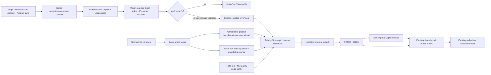

# AI LIVE — Local-first runtime

สถานะวันที่ 6 ตุลาคม 2026 บน `feature/ai-live` ต่อจาก `7dfdca566af52b724e3ad29fefc8559072adfaf4` และ checkpoint `checkpoint/ai-live-local-first-7dfdca5` ไม่มี merge/deploy หรือเปลี่ยน TikTok config

## ขอบเขตและสถานะจริง

| ส่วน | สถานะ | หลักฐาน/ข้อจำกัด |
| --- | --- | --- |
| Local Brain | READY_WITHOUT_GPU สำหรับ CPU DEV | Qwen3-4B Q4_K_M ผ่าน inference จริง; ไม่รับรอง realtime หรือคุณภาพภาษาไทยแบบอิสระ |
| Product grounding | READY_WITHOUT_GPU | ใช้ข้อมูลจริงที่ server เซ็นและผูก owner/device/account/products; ข้อเท็จจริงตอบด้วย template; ไม่ทราบต้องตอบว่าไม่พบข้อมูล |
| Local TTS contract/Thai preprocessing/cache | READY_WITHOUT_GPU | PCM16 mono 16kHz, sentence chunks, cancel, bounded cache และ tests; ไม่มี paid fallback |
| VoxCPM2 | LOCAL_TTS_MODEL_PENDING | code/weights Apache-2.0; ตรวจ bytes/hash จริงแล้ว แต่ RAM ว่างไม่พอโหลด CPU; ยังไม่มีเสียงจริงหรือ owner quality ratings |
| Voice Packs | READY_WITHOUT_GPU สำหรับ rights/storage contract | consent, provenance, account/presenter bindings และข้อมูลเข้ารหัส; cloning adapter ยังปิดจนส่ง reference ในหน่วยความจำได้อย่างปลอดภัย |
| Model delivery | READY_WITHOUT_GPU สำหรับ installer contract | signed release, resume/hash/license/notices, atomic activation/repair/rollback/uninstall; ยังไม่ได้เผยแพร่ signed local-AI release |
| All-stage warmup | READY_WITHOUT_GPU สำหรับ execution boundary | warm Brain/TTS, render frame จาก reference ที่เลือก และ encode PCM+JPEG จริงก่อน Start; pending/failure ไม่ขึ้นพร้อม |
| GPU profiles | GPU_VALIDATION_REQUIRED | 8/12/16GB เป็นเป้าหมาย reservation เท่านั้น ยังไม่ใช่ benchmark NVIDIA |
| End-to-end Brain → real TTS → presenter → encoder | WAITING_FOR_TTS | contract tests ใช้ production boundary โดยแทนเฉพาะ native model/encoder; ไม่ถือเป็น real neural voice proof |

## เส้นทางที่ใช้จริง

Cloud ใช้สำหรับบัญชี/สิทธิ์/ข้อมูล/analytics/updates เท่านั้น inference ไม่เรียก cloud AI ไม่ขอ customer API key และไม่เงียบสลับเป็น mock หรือเสียงของระบบปฏิบัติการ หน้า customer มีเพียง “AI พร้อม / เสียงพร้อม / คน LIVE พร้อม” และสถานะที่มาจาก health จริง

## ข้อมูลสินค้าและการทำงาน offline

`/api/ai-live/product-context` ตรวจ session ใหม่, RLS owner, membership, registered device และเลือกจาก products/accounts เดิม ไม่รับราคา/stock จาก browser คืน signed context อายุไม่เกิน 120 วินาทีให้ Local Agent ตรวจ signature, versions และทุก binding อีกครั้ง ก่อนเริ่มใหม่ต้อง sync ใหม่ ระหว่าง room ทำงานใช้ snapshot ที่รับรองไว้ในหน่วยความจำ ไม่ต้องติดต่อ cloud AI; network ของ stream และระยะ lease ของ membership ยังคงข้อกำหนดเดิม

ข้อเท็จจริงที่ไม่มีในร้านไม่ถูกเติม เช่น stock ไม่อนุมานจาก available, promotion ไม่อนุมานจากราคาเดิม LLM ไม่ได้รับ owner IDs และไม่สร้างข้อมูลการขายใหม่ ข้อความทั่วไปที่ผ่าน LLM ต้องผ่าน non-factual phrase guard; cache แยก owner/account/room และ product version

การรับ signed context ใหม่ส่งต่อถึงห้อง prepared/live ที่ตรง owner/account เท่านั้น อัปเดต snapshot/cache และยกเลิกเสียงที่อ้าง product context เก่า Backend health ต้องยังผ่าน ณ เวลาตรวจและ Start; ผล warmup ที่สำเร็จในอดีตไม่ทำให้ process ที่ตายแล้วยังขึ้นพร้อม

## การติดตั้งและความปลอดภัย

Model Manager ใช้ BootstrapManager เดิม ไม่มี downloader แยก ลูกค้าไม่กรอก path/command/model token รุ่นติดตั้งต้องมี `models/local-ai/catalog.json` และทุก artifact รวม LICENSE/NOTICE ต้องอยู่ใน outer signed manifest พร้อม hash/size ที่ตรงกัน code และ weights ต้องอนุญาต commercial/redistribution; NC/research/unknown ถูกปฏิเสธก่อน download หรือ activation

`local-brain-candidates.json` / `local-tts-candidates.json` เป็น research/planning เท่านั้น ไม่ใช่ catalog ที่เชื่อถือให้ติดตั้งได้ Publisher ต้องสร้าง archive ของ runtime/models พร้อม catalog, ตรวจ dependency notices แล้วเซ็นด้วยช่องทาง release เดิม ไม่ใช้ hash ที่เดาหรือปล่อยค่า null ใน install catalog

llama.cpp รับเฉพาะ fixed loopback, random private auth token และ path ที่ตรวจ hash แล้ว Windows เก็บ state นอก immutable release ด้วย user/SYSTEM DACL; cross-process mutex ตรวจ RAM ก่อนโหลดหลาย room ไม่ inherit cloud keys/proxy หรือ arbitrary runtime flags Worker ใช้ inherited pipes + owned child job tree; shutdown และ request มีขอบเขต ไม่มี arbitrary shell

Resource Manager ให้ priority Presenter > TTS > Brain > Background และมี bounded queues/cancellation/model reservations ปัจจุบัน managed voice/Brain ใช้ CPU admission; GPU/offload profiles ยังไม่เปิดอัตโนมัติจนมี validation การจอง VRAM ไม่ใช่หลักฐาน FPS/lip sync หรือจำนวน room ที่รองรับ

## หลักฐานและสิ่งที่รอ

ดู [CPU Brain proof](../benchmarks/local-brain-cpu-proof.json), [Brain research](LOCAL_BRAIN_RESEARCH.md), [TTS research](LOCAL_TTS_RESEARCH.md), [TTS CPU preflight](../benchmarks/local-tts-cpu-preflight.json) และ `tts-training/rights-plan.json` ผลจริงแยกจาก fixtures ชัดเจน

TTS ยังต้องมี RAM ที่เพียงพอ/locked offline dependencies, เสียง benchmark จริง, owner Thai/naturalness/consistency ratings, latency/RTF/interruption และ long-session acceptance ที่รวมใน signed release ก่อนเลือก voice สำหรับ production ยังไม่ train โมเดลใหญ่และไม่ใช้ NC weights เป็นฐานฝึก

NVIDIA ยังต้องพิสูจน์ concurrent Presenter/TTS/Brain/encoder, VRAM/FPS/latency/lip sync/long-session/multi-room จริง `AI_LIVE_REALTIME_VALIDATED` ไม่ถูกเปิด TikTok LIVE transport/eligibility/comments/product pinning ไม่ได้เพิ่มในรอบนี้; POST/AUTO เดิมไม่ถูกแก้

## ผลตรวจรอบสุดท้าย

- Python: 404 tests ผ่าน โดย skip 2 opt-in tests สำหรับ real presenter weights/reference และ Windows native speech; ไม่ถือว่าเป็นหลักฐาน real neural TTS/GPU
- AI LIVE TypeScript: 185 tests ใน 31 files ผ่าน
- `pnpm typecheck` ผ่าน; `pnpm lint` ไม่มี errors แต่มี warnings เดิม 8 รายการในไฟล์นอกขอบเขตนี้
- `pnpm build` ผ่านด้วย public Supabase placeholder ใน process environment ตาม quality CI เดิม เพราะเครื่องไม่มี public build configuration ที่ต้องใช้; ไม่อ่านหรือแก้ `.env.local` และไม่รับรอง external credentials/production deployment
- CPU Brain proof ใช้โมเดลจริงและบันทึกแยกจาก tests; TTS CPU preflight ไม่ได้สร้างเสียง จึงยังเป็น `LOCAL_TTS_MODEL_PENDING`

รอบนี้ส่งเฉพาะ branch `feature/ai-live` ไม่มี merge หรือ deploy Production และไม่ประกาศ LIVE-1 complete
