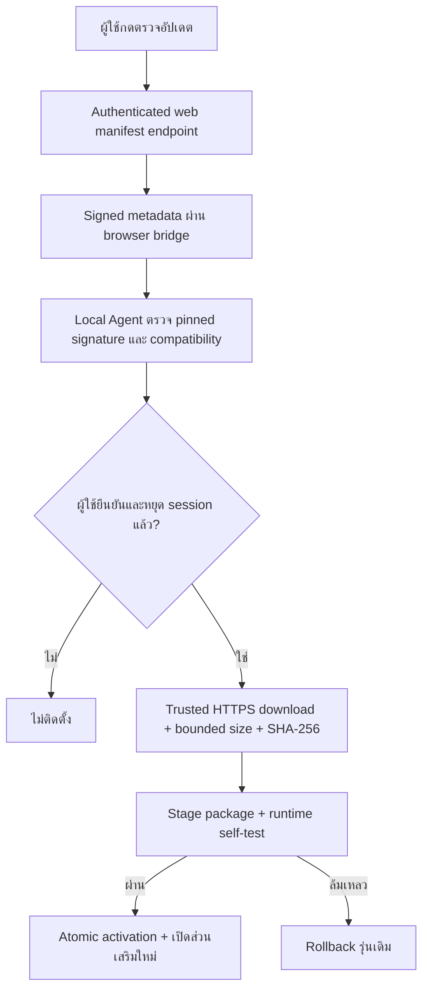

# AI LIVE Server Activation Foundation — 2026-10-02

ทำบน `feature/ai-live` ต่อจาก `8dd584e46c28ede6b224abe6e2db41a464c8c5f4` รุ่น component ใหม่ `0.3.0` งานนี้ทำเฉพาะทะเบียนเครื่อง การตั้งค่าลายเซ็น/สมาชิก การแจกอัปเดต และ UI ที่เกี่ยวข้อง ไม่มี TikTok config/OAuth/scopes/AUTO changes, GPU validation, merge หรือ Vercel Production deployment

## สถานะจริง

| ส่วน | สถานะ |
| --- | --- |
| Registry migration | APPLIED ONCE บน Supabase project เดิม `viralflow-ai` |
| Device endpoints / signing / entitlement | CODE READY; ยังไม่ deploy/configure signer หรือให้สิทธิ์สมาชิกจริง |
| Update distribution / download / install / rollback | FOUNDATION READY; local/test distribution ใช้ production boundaries เดียวกัน |
| Production release hosting / Authenticode | OWNER/RELEASE REQUIRED; ไม่สร้าง infrastructure เสียเงิน |
| Presenter / audio sync / encoder | WAITING_FOR_GPU / GPU_VALIDATION_REQUIRED |
| LIVE-1 / production livestream | NOT COMPLETE / NOT ENABLED |

## ฐานข้อมูลและ owner isolation

ไฟล์เดิม `20261001091106_ai_live_device_registration.sql` สร้างตาราง `ai_live_devices`, `ai_live_device_challenges`, `ai_live_device_lease_nonces` กับ RPC register/claim/revoke เท่านั้น ไม่มี ALTER/DELETE ข้อมูลผู้ใช้เดิม Apply ผ่าน connector เพียงครั้งเดียว remote history name `ai_live_device_registration`, version `20261001172630`; local migration count 26 / remote 26

ทุกตารางเปิด RLS และไม่มี grants ให้ `anon`/`authenticated` ผู้ใช้เข้าถึงผ่าน authenticated server endpoints ซึ่งกำหนด owner จาก fresh Auth user เท่านั้น ไม่รับ ownerId จาก browser RPC เป็น SECURITY INVOKER, empty search_path, service-role EXECUTE only; advisory transaction locks จำกัดเครื่องแบบ atomic มี one-time nonce/replay protection และ revoke ไม่ลบ history ของผู้ใช้

ทดสอบ SQL/RLS แบบ isolated 26 ข้อ และ shared rollback-only acceptance 17 ข้อ บนฐานข้อมูลจริงด้วย `supabase/tests/ai_live_device_registration.sql` ผ่าน ลงทะเบียนซ้ำไม่เพิ่ม row, owner อื่น revoke/claim ไม่ได้, limit/expiry/replay/revoke ทำงาน, authenticated/anon อ่านหรือ revoke ตรงไม่ได้ ใช้เจ้าของเดิม read-only ไม่สร้าง/แก้ `auth.users` ข้อมูลทะเบียนทดสอบทั้งหมด rollback

Security Advisor ไม่มี ERROR; INFO เรื่อง RLS ไม่มี policy ในสามตารางใหม่นี้เป็น service-only design และมี INFO เดิมใน TikTok tables อีกสองตาราง มี WARN เดิมเรื่อง leaked-password protection disabled ซึ่งไม่ได้เปลี่ยนในงานนี้ [รายละเอียดการป้องกันรหัสผ่าน](https://supabase.com/docs/guides/auth/password-security#password-strength-and-leaked-password-protection)

## Signing และ key rotation

Schema ฝั่ง server อยู่ `server-config.ts` / `local-license.ts` ประเมินเมื่อเรียก feature ไม่ทำให้ AUTO ต้องมี LIVE config มีเพียงชื่อและช่องว่างใน `.env.example` ไม่สร้างหรือเก็บ production secrets ใน repo

- `AI_LIVE_LEASE_SIGNING_PRIVATE_KEY`: Ed25519 PKCS8, server only
- `AI_LIVE_SIGNING_KEY_ID`: current key identifier
- `AI_LIVE_SIGNING_PUBLIC_KEYS_JSON`: keyId → Ed25519 SPKI PEM ที่ไว้ใจได้ สูงสุด 8 keys; current private/public ต้องตรงกัน
- `AI_LIVE_SIGNING_LEGACY_PUBLIC_KEY`: optional transition pin สำหรับ envelope เดิม กำหนดอย่างชัดเจน ห้าม fallback ไป key ที่ browser ส่งมา

Modern envelope `{payload, signature, keyId}` ลงลายเซ็น canonical `{keyId,payload}` จึงเปลี่ยน keyId ไม่ได้ Legacy envelope canonical payload ใช้ได้เฉพาะ trusted legacy pin Signed challenge อายุไม่เกิน 120 วินาที certificate ผูก owner/device/public-key fingerprint Start grant อายุไม่เกิน 120 วินาทีผูก selection/version และใช้ครั้งเดียว

Rotation: ออก package ที่ pin public key เก่าและใหม่ก่อน แจก/ยืนยันด้วย key เก่าที่ยังไว้ใจได้ จากนั้นจึงเปลี่ยน active signing key ฝั่ง server เครื่องที่ยังไม่ไว้ใจ key ใหม่ต้องอัปเดต ไม่รับ key ผ่าน browser เมื่อพ้นช่วงเปลี่ยนผ่านให้เอา retired public key ออกจาก trusted configuration ทดสอบ unknown/retired/tampered keyId ต้อง deny

Private key ต่อเครื่องเก็บ Windows current-user DPAPI ไม่มี plaintext identity secret, private signer ไม่ส่ง browser/agent ไม่มี production secret generation/configuration ในรอบนี้

## Membership authority

ใช้ fresh `auth.getUser()` แล้วอ่านเฉพาะ trusted `app_metadata.ai_live` ผ่าน server schema `enabled`, `status`, `revokedAt`, `expiresAt`, `deviceLimit` ไม่ใช้ editable `user_metadata` และไม่ใช้ certificate ในเครื่องเป็นสิทธิ์สมาชิก Missing/inactive/revoked/expired → deny; duplicate register ยังตรวจ entitlement สด Revoke เป็น owner operation ทำได้แม้สมาชิกหมดอายุ

`GET /api/ai-live/entitlement` คืนเพียง `{supported:boolean}` authenticated, rate-limited, no-store ไม่คืน expiry/limit/internal permission หรือ secret ให้ UI การตรวจนี้ยังทำได้เมื่อไม่พบส่วนเสริม

ไม่สร้างสมาชิกผ่าน tests ใน production ไม่ให้ local bypass Start ต้องผ่าน fresh entitlement + active registry + signed device proof + nonce/owner/selection check; การหมดอายุ grant คือ authorization ตอน Start ไม่ใช่ heartbeat ระหว่าง stream และไม่อ้างว่า revoke หยุดเครื่อง offline ได้ทันที

## Update distribution

`LiveUpdateDistribution` เป็น provider abstraction; `ConfiguredLiveUpdateDistribution` ใช้ fixed trusted HTTPS origin กับ release metadata ที่ตรวจ schema จาก `AI_LIVE_UPDATE_ORIGIN` / `AI_LIVE_UPDATE_RELEASE_JSON` ไม่มีการสร้าง bucket หรือเปิดโฮสต์เสียเงิน

Signed manifest v2 มี current `versions`, `minimumVersions`, `mandatory`, `rollbackVersion`, `package.url`, SHA-256, size, issuedAt/expiresAt และ signed keyId โดย URL มาจาก configured origin + fixed release path ไม่รับ download URL จาก browser Manifest endpoint `GET /api/ai-live/updates/manifest` ต้องมี authentication, fresh entitlement, rate limit และ server signing configuration; ไม่มี config → 503 พร้อมข้อความปลอดภัย

Web cookies ใช้กับ same-origin manifest endpoint เท่านั้น ไม่ส่งไป loopback หรือ release host Local Agent ดาวน์โหลด package ที่ไม่เก็บ secret หลังตรวจ signed URL/pinned host ไม่ตาม redirects ไม่ปิด TLS certificate verification ไม่รับ arbitrary URL/IP/private-network target และติดตั้งเฉพาะ payload ที่ผ่าน hash/signature/size/path checks

เช็กจาก customer UI ได้ อัปเดต/ซ่อมแซมต้องยืนยัน ก่อนติดตั้งต้องไม่มี active session รองรับ mandatory/update-required กับ optional update; background operation จำกัดหนึ่งงาน ไม่ duplicate installs มี rollback เก็บ encrypted identity และไม่มี silent fallback เป็น mock

รุ่น `0.2.0` ยังไม่มี distribution endpoints/keyring ใหม่นี้ ต้องใช้ installer `0.3.0` เพื่อ bootstrap ก่อน ห้ามอ้างว่าสามารถอัปเดตผ่าน endpoint ที่ binary เก่าไม่มี

## งานสำหรับเจ้าของ/ผู้ดูแลก่อนเปิดใช้งานจริง

1. ตั้ง server-only signer และ trusted public key ring ใน environment ที่ต้องการเปิด LIVE โดยไม่แก้ TikTok credentials/config
2. Provision AI LIVE entitlement จาก membership authority จริงผ่าน supported server/admin API; ไม่เปิดให้ user แก้ app_metadata
3. Build installer พร้อม public trust config ที่ตรงกับ server, ลง Authenticode และเลือก release hosting ที่มีอยู่/ได้รับอนุมัติ ตั้ง hash/size/version จาก artifact จริงเท่านั้น
4. Deploy server endpoints/UI เมื่ออนุมัติเปิดใช้ environment นั้น แล้วทดสอบ HTTPS→local browser permission กับ signed installer
5. รอ NVIDIA และ GPU acceptance แยกต่างหากก่อนเปิด real Start; งานนี้ไม่ทำส่วนดังกล่าว

## ผลทดสอบรอบนี้

- TypeScript AI LIVE/routes: **91/91 ผ่าน**, 15 test files ใช้ production handlers/services และ mock เฉพาะ external/network boundaries ที่จำเป็น
- `pnpm typecheck`: ผ่าน
- `pnpm lint`: exit 0 / ไม่มี error; 8 warning เดิมใน video benchmark/tests นอกขอบเขต ไม่แก้ไฟล์เหล่านั้น
- `pnpm build`: ผ่าน มี device/entitlement/manifest routes ใน build output ใช้ public Supabase placeholders เฉพาะ process ไม่แก้ `.env.local` และไม่อ้าง live database acceptance จาก build
- SQL isolated: **26/26** และ shared rollback-only acceptance **17/17**; ชุด shared ผ่านบน Supabase จริงด้วย หลัง rollback ตรวจ device/challenge/lease rows เป็น 0 และ migration name มี 1 รายการ
- มีการเรียก whole-repository TypeScript suite โดยไม่ตั้งใจจากรูปแบบ CLI separator พบสองปัญหานอกขอบเขตเดิม: scheduler test คาด cron ที่ถูกเอาออกสำหรับ Hobby และ FFmpeg spawn ถูก sandbox ปฏิเสธ ไม่มีการแก้ AUTO/scheduler/video หรืออ้างว่า full repository suite ผ่าน
- Python: **95/95 ผ่าน** รวม 17 distribution regressions และ 2 artifact tests ผ่าน real packaged runtime/production launcher, fresh install, corruption repair, uninstall และ DPAPI identity ในพื้นที่ทดสอบแยก Mandatory update ที่ rollback ยัง block Start; manifest v2 ไม่มี authenticated keyId ถูกปฏิเสธ
- Installer `0.3.0` สร้างสำเร็จ 54,019,573 bytes; update package 44,627,324 bytes ตรวจ hash/size ตรงกับ [installer evidence](../workers/ai-live/installer/README.md) ทั้งสองไฟล์ ignored และไม่ได้เผยแพร่ ตัวติดตั้งยัง `NotSigned`, trust/update channel ยังไม่ตั้งและ fail closed ไม่มี production registration/member หรือ GPU acceptance ที่ถูกอ้างว่าผ่านจาก mock
