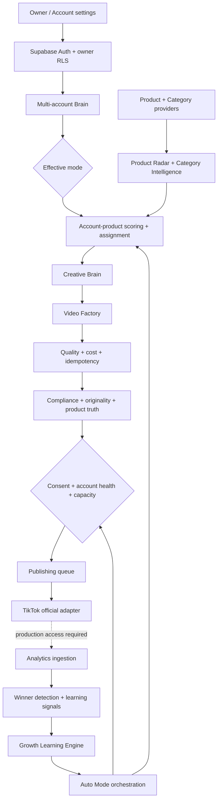
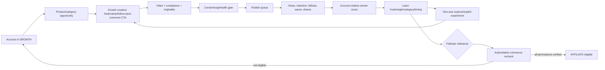
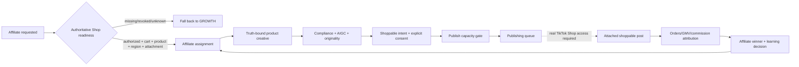
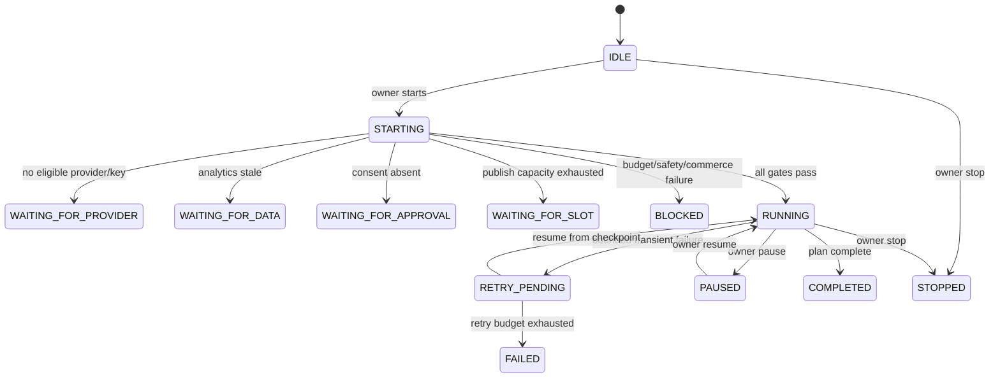
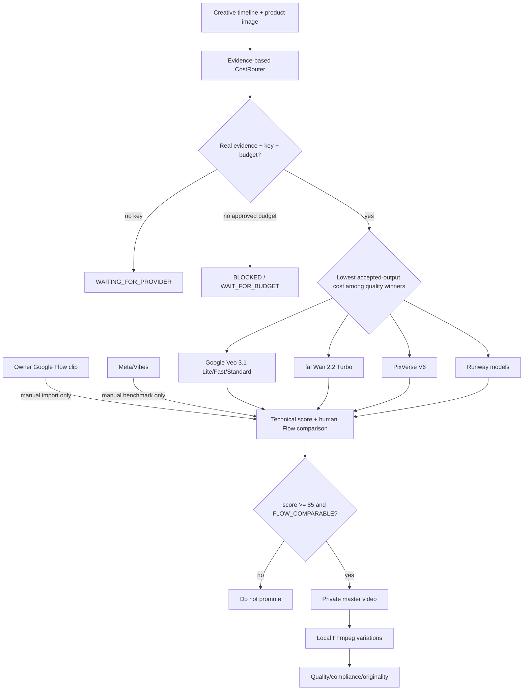
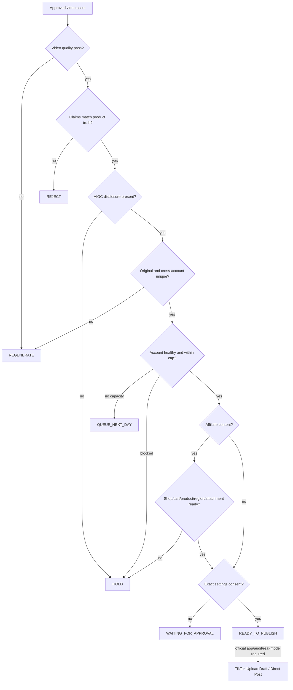

# ViralFlow AI — Project Master Status

อัปเดตล่าสุด: 18 กันยายน 2026  
สถานะที่ตรวจ: `feature/google-veo-provider`  
code baseline HEAD: `9140ea38c11dcbe7d243665ac89170114f8f70e2` (`feat: add Google Veo video provider integration`)  
remote baseline: `origin/feature/google-veo-provider` ตรงกับ code baseline และ working tree สะอาดก่อนสร้างเอกสารนี้

## Executive status

| ตัวชี้วัด | ผลประเมินใหม่ | วิธีคำนวณ |
|---|---:|---|
| Overall completion | **80%** | `60% × coding completion + 40% × production readiness` ปัดเป็นจำนวนเต็ม |
| Coding completion | **96%** | งานวิศวกรรมที่ตรวจจากโค้ด/มigrations/tests 143 จุดเสร็จ และ 6 จุดยังเหลือ: `143 ÷ 149` |
| Production readiness | **56%** | rubric 100 คะแนนด้านคุณภาพ ข้อมูล/provider, TikTok, commerce, analytics, Auto Mode และ operations |

ตัวเลขนี้คำนวณจาก repository, migration history บน Supabase และผลตรวจล่าสุด ไม่ได้นำเปอร์เซ็นต์จากประวัติแชทมาใช้ งานใน `docs/TASKS.md` มี 141 ช่องที่ติ๊กเสร็จและ 15 ช่องเปิดอยู่ โดย 2 ช่องใต้หัวข้อเดิม “Next phase — Growth Learning Engine” ถูก Phase 9 ทำเสร็จภายหลังแล้ว จึงใช้หลักฐานจาก implementation และ tests เป็นตัวตัดสินแทนการนับ checkbox ตรง ๆ

### Coding completion rubric

143 acceptance points ที่เสร็จครอบคลุม Phase 0–10, migrations, UI, service boundaries, RLS, tests และ Google Veo integration ส่วน 6 จุดที่ยังเป็นงานวิศวกรรมคือ:

1. รัน real video benchmark และ promote provider ที่มีหลักฐานครบ
2. ปิดงาน real TikTok account sync หลังได้ app access
3. เปิดและตรวจ real TikTok publishing หลังผ่าน audit/approval
4. ต่อ real TikTok Shop product discovery/attachment หลังได้สิทธิ์
5. ต่อ real TikTok analytics ingestion หลังได้ scopes
6. ทำ Phase 11 security, performance, observability และ production release review

ดังนั้น coding completion = `143 / (143 + 6) = 95.97%` หรือ **96%**

### Production readiness rubric

| หมวด | คะแนน | หลักฐานและช่องว่าง |
|---|---:|---|
| Code quality และ reproducible build | 15/15 | typecheck, lint, 226 tests และ production build ผ่าน |
| Database, RLS, auth และ secrets | 13/15 | 14 migrations อยู่บน Supabase, public tables 59 ตารางเปิด RLS; ยังมี Auth warning 1 รายการ |
| Video Factory และ real provider | 6/12 | FFmpeg/master/variation/cost gates ใช้งานได้; ยังไม่มี paid benchmark winner |
| TikTok OAuth และ publishing | 5/15 | official contracts/queue/gates มีแล้ว; production app, scopes, audit และ real calls ยังไม่เปิด |
| TikTok Shop / Affiliate | 3/10 | readiness และ fail-closed commerce logic มีแล้ว; real API/attachment ยังถูก gate |
| Analytics และ Growth learning | 7/10 | scoring/learning/experiments ครบ; production data providers ยัง approval-required |
| Auto Mode safety/orchestration | 7/10 | durable orchestration, budgets, retries, consent และ idempotency มีแล้ว; runtime จริงยัง mock/local |
| Operations และ deployment | 0/13 | ยังไม่มี production deployment, load test, monitoring/alerting, backup/restore drill และ incident runbook |
| **รวม** | **56/100** | **56%** |

## Repository inventory

- Framework: Next.js 16.3.5 App Router, React 19.3, TypeScript 6.0, Tailwind CSS 4
- Data/Auth: Supabase SSR และ `@supabase/supabase-js`
- Package manager: pnpm 11.19.0; Node.js ขั้นต่ำ 24
- UI pages: **35** `page.tsx` routes
- Server route handlers: **3** (`TikTok OAuth start`, `TikTok OAuth callback`, `Content Posting webhook`)
- Feature domains: **14** — accounts, analytics, assignments, auto, categories, commerce, compliance, creative, growth, products, publishing, TikTok, video และ video benchmark
- Test files: **17**
- Tests: **226/226 ผ่าน** รวม real FFmpeg render/probe
- Latest verified code commits: Phase 8 `a0ef575`, Phase 9 `a26a82f`, Phase 10 `c2cd40f`, CostRouter fix `42bfaa0`, Google Veo `9140ea3`

### Routes

| กลุ่ม | Routes |
|---|---|
| Foundation | `/`, `/login`, `/dashboard`, `/settings`, `/settings/integrations` |
| Accounts | `/accounts`, `/accounts/[id]`, `/accounts/connect/tiktok` |
| Intelligence | `/product-radar`, `/product-radar/[id]`, `/categories`, `/categories/[id]`, `/recommendations` |
| Creative/Video | `/creative-studio`, `/creative-studio/[id]`, `/video-factory`, `/video-factory/[id]`, `/compliance` |
| Publishing/Commerce | `/publishing`, `/publishing/[id]`, `/publisher`, `/commerce`, `/commerce/accounts/[id]`, `/commerce/products` |
| Analytics/Learning | `/analytics`, `/analytics/accounts/[id]`, `/analytics/products/[id]`, `/analytics/videos/[id]`, `/learning` |
| Growth | `/growth`, `/growth/accounts/[id]`, `/growth/experiments` |
| Auto | `/auto`, `/auto/runs/[id]`, `/auto-mode` |
| Server handlers | `/auth/tiktok/start`, `/auth/tiktok/callback`, `/api/tiktok/webhooks/content-posting` |

## Database and Supabase

Supabase project `viralflow-ai` (`nbtshqmtspgzrfzkqjxx`) อยู่สถานะ `ACTIVE_HEALTHY` ใน `ap-northeast-2` และใช้ PostgreSQL 17.6.1

### Migration history

มี migration ใน source control **14 ไฟล์** และ Supabase migration history **14 รายการ** ครบตามลำดับ ไม่มี migration สำหรับ Google Veo เพราะ Phase 6 schema รองรับ provider/model/cost/evidence อยู่แล้ว

| Phase | Local migration | Supabase applied version | สถานะ |
|---|---|---|---|
| 1 | `20260914112027_phase_1_foundation.sql` | `20260914112950` | DONE |
| 2 | `20260914120831_phase_2_multi_account_brain.sql` | `20260914122225` | DONE |
| 3 | `20260914170656_phase_3_product_radar.sql` | `20260914171647` | DONE |
| 4 | `20260915021303_phase_4_category_intelligence.sql` | `20260915022255` | DONE |
| 5A | `20260915084502_phase_5a_account_product_assignment.sql` | `20260915085242` | DONE |
| 5B | `20260915142500_phase_5b_creative_brain.sql` | `20260915141010` | DONE |
| 6 | `20260915195004_phase_6_video_factory.sql` | `20260915200321` | DONE |
| 6C | `20260917090000_phase_6c_compliance_originality.sql` | `20260917140305` | DONE |
| 7A | `20260917150532_phase_7a_tiktok_oauth_foundation.sql` | `20260917152011` | DONE |
| 7B | `20260917191816_phase_7b_tiktok_publishing_foundation.sql` | `20260917193552` | DONE |
| 7C | `20260918021720_phase_7c_tiktok_shop_foundation.sql` | `20260918023607` | DONE |
| 8 | `20260918042934_phase_8_analytics_learning.sql` | `20260918043704` | DONE |
| 9 | `20260918090808_phase_9_growth_learning_engine.sql` | `20260918091633` | DONE |
| 10 | `20260918092843_phase_10_full_auto_mode.sql` | `20260918093641` | DONE |

Supabase รายงาน public tables **59 ตาราง** และทุกตารางเปิด RLS การที่ `tiktok_oauth_credentials` และ `tiktok_oauth_states` ไม่มี browser policy เป็นการออกแบบ server-only แต่ Security Advisor แสดงเป็นข้อมูล `rls_enabled_no_policy` 2 รายการ จึงต้องคงไว้ใน security review ไม่ควรเพิ่ม client policy เพื่อทำให้คำเตือนหาย

Security Advisor ปัจจุบันมี warning `auth_leaked_password_protection` 1 รายการ เพราะ Leaked Password Protection ยังปิดอยู่ นี่เป็น owner action ก่อน production

## Phase status

คำจำกัดความ:

- **DONE** — implementation, persistence และ automated verification ของ scope นั้นอยู่ใน repository
- **PARTIAL** — foundation เสร็จ แต่ production path ยังขาดหลักฐาน, credentials, approval หรือ integration จริง
- **PLANNED** — ยังไม่มี implementation ครบใน repository

| Phase | Scope | สถานะ | หมายเหตุจาก repository |
|---|---|---|---|
| 0 | Architecture และ product plan | DONE | architecture approved และเอกสารหลักมีอยู่ |
| 1 | Next.js/Supabase/Auth/dashboard | DONE | protected app, settings, env validation, RLS และ build |
| 2 | Multi-account brain | DONE | Growth/Affiliate/Auto request, readiness, stats, affinity |
| 3 | Product Radar | DONE | snapshots, product-momentum-v1, history, filters/detail |
| 4 | Category Intelligence | DONE | category scoring, states, affinity และ Product Radar signal |
| 5A | Account-product assignment | DONE | account-product-fit-v1, diversification และ daily planner |
| 5B | Creative Brain | DONE | structured concepts, lifecycle, risk, cost/provider evidence |
| 6 | Video Factory | DONE | private media, FFmpeg, master/variation, quality/cost/idempotency |
| 6B | Real provider benchmark | PARTIAL | harness/providers พร้อม แต่ยังไม่มี licensed inputs, owner Flow baseline และ paid evidence |
| 6C | Compliance/originality | PARTIAL | engine และ persistence เสร็จ; `TASKS.md` ยังเปิด authenticated browser signoff ไว้ |
| 7A | TikTok OAuth/creator sync | PARTIAL | official adapter และ secure token boundary มี; production app config/scopes ยังไม่มี |
| 7B | Publishing queue | PARTIAL | queue, consent, retry, webhook และ official adapter มี; real mode ปิด |
| 7C | TikTok Shop foundation | PARTIAL | commerce readiness และ fail-closed provider มี; real Shop/attachment ยังไม่มี |
| 8 | Analytics/winner/learning | PARTIAL | models, scores, views และ simulation เสร็จ; real analytics access ยังไม่มี |
| 9 | Growth Learning Engine | DONE | account-relative patterns, experiment, milestone/recheck และ simulation |
| 10 | Full Auto Mode | PARTIAL | durable orchestration และ safety gates เสร็จ; external execution ยัง mock/local |
| Google Veo | Veo 3.1 provider + CostRouter evidence | PARTIAL | adapter/tests/cost model เสร็จ; ไม่เคยเรียก paid benchmark และยังไม่มี winner |
| 11 | Security/performance/production review | PLANNED | ยังไม่เริ่ม production hardening/release gate |

## Master system flow

## Growth flow

## Affiliate flow

## Auto Mode flow

Auto Mode ใช้ stable idempotency keys, append-only steps/actions/failures/checkpoints, per-video/run/account/provider/daily/monthly budget gates และ recovery จาก checkpoint ล่าสุด ไม่มีเส้นทางข้าม consent หรือ safety gate

## Video provider flow

Google Veo status:

- `GoogleVeoProvider` รองรับ Veo 3.1 Lite, Fast และ Standard ผ่าน server-only key
- มี long-running operation polling, bounded retry/download, normalized failures และ key redaction
- Lite เป็น cost-first candidate เท่านั้น ยังไม่ใช่ production default
- Google Flow เป็น `MANUAL_BENCHMARK_ONLY`; credit/subscription ของ Flow ไม่ถูกนับเป็น Gemini API budget
- `VIDEO_BENCHMARK_ALLOW_PAID=false` และ `VIDEO_BENCHMARK_MAX_USD=0` เป็นค่าเริ่มต้น
- benchmark catalog ยังคง fal Wan 2.2 Turbo, PixVerse V6, Runway fallbacks, Meta manual และ TikTok Symphony `NOT_RUN`
- สถานะปัจจุบัน: **ยังไม่มี real benchmark winner และไม่มี paid call จากงานตรวจนี้**

## TikTok compliance and publishing flow

## Service readiness

| Service/domain | สถานะ code | สถานะ production |
|---|---|---|
| Supabase Auth/SSR/RLS | DONE | PARTIAL — enable leaked-password protection และ production env review |
| Accounts/Product/Category/Assignment | DONE | PARTIAL — real TikTok/Shop sources ยังไม่เปิด |
| Creative Brain | DONE | PARTIAL — default deterministic mock; OpenAI optional |
| Video Factory/FFmpeg | DONE | DONE สำหรับ local renderer; real AI master provider ยัง PARTIAL |
| Google Veo | DONE adapter | PARTIAL — key/budget/benchmark/winner ยังไม่มี |
| Compliance/Originality | DONE engine | PARTIAL — authenticated Phase 6C browser signoff ยังเปิดใน task ledger |
| TikTok OAuth | DONE foundation | PARTIAL — developer app/scopes/redirect/audit |
| TikTok Publishing | DONE foundation | PARTIAL — default mock, `TIKTOK_PUBLISHING_REAL_MODE=false` |
| TikTok Shop | DONE foundation | PARTIAL — default mock, official access approval-required |
| Analytics/Winner detection | DONE foundation | PARTIAL — real Display/Shop Analytics ingestion approval-required |
| Growth Engine | DONE | PARTIAL — production learning needs real observations |
| Auto Mode | DONE orchestration | PARTIAL — mock/local verified; external execution disabled |

## Latest quality verification

ตรวจบน code baseline เดียวกับเอกสารนี้:

| Check | ผล |
|---|---|
| `pnpm typecheck` | PASS |
| `pnpm lint` | PASS |
| `pnpm test` | PASS — 17 files, 226 tests; FFmpeg test ต้องรันใน environment ที่อนุญาต child process |
| `pnpm build` | PASS — Next.js production build สำเร็จ |
| Supabase project | `ACTIVE_HEALTHY` |
| Supabase migrations | PASS — 14 applied |
| Public table RLS | PASS — 59/59 enabled |
| Security Advisor | PARTIAL — 1 Auth warning, 2 intentional server-only info findings |

## Blockers

1. **Real video winner ไม่มีหลักฐาน** — ขาด owner Flow reference, licensed Beauty/Home/Gadget inputs, provider key และ explicit spend approval
2. **TikTok production access ยังไม่พร้อม** — ขาด app products/scopes, verified redirect/pull domains, Direct Post audit และ explicit enablement
3. **TikTok Shop/Affiliate access ยังไม่พร้อม** — ขาด Partner/Creator API approval, category/region access, seller authorization และ attachment capability
4. **Real analytics ยังไม่พร้อม** — Display และ Shop Analytics scopes/authorization ยัง approval-required
5. **Production operations ยังไม่ทำ** — ยังไม่มี deployment, monitoring, load/performance evidence, backup/restore drill และ incident/release runbook
6. **Supabase Auth warning** — Leaked Password Protection ยังปิด
7. **Phase 6C signoff gap** — task ledger ยังระบุ authenticated browser verification/cleanup เป็นงานค้าง

## Owner and external actions

1. เปิด Supabase Auth Leaked Password Protection และทบทวน production auth policy
2. จัดหา Flow AI reference clips และรูปสินค้า Beauty/Home/Gadget ที่มีสิทธิ์ใช้งาน
3. ใส่ provider keys ฝั่ง server และอนุมัติงบ benchmark แบบมี hard cap ก่อนเรียก paid API
4. ตั้งค่า TikTok developer app, scopes, redirect URI, verified domain, audit และ test creators
5. ขอ TikTok Shop/Affiliate/Analytics approvals และ seller authorization ที่จำเป็น
6. อนุมัติการเปิด real publishing แยกจากการมี OAuth connection และยืนยัน consent policy
7. เลือก production host/domain/region, monitoring, alerting, backup และ incident owner

## Next 5 actions

1. **Phase 11 readiness audit:** ทำ threat model, dependency/security review, performance/load test, observability, backup/restore และ release checklist โดยไม่เปิด external calls
2. **Close Phase 6C signoff:** ทำ authenticated browser verification ตาม task ledger และยืนยันว่าไม่มี temporary data เหลือ
3. **Resolve Supabase Auth warning:** เปิด leaked-password protection แล้วรัน Security Advisor ใหม่
4. **Run capped video benchmark:** หลัง owner ส่ง licensed fixtures/Flow baseline/key/budget ให้รัน Veo Lite cost-first stage และบันทึก accepted-output cost + human comparison
5. **TikTok sandbox-to-production plan:** รับ app/Shop/Analytics approvals แล้วทดสอบ OAuth → sync → draft publish → analytics ใน sandbox/test account ก่อนพิจารณา real mode

## Production decision

ระบบอยู่ในสถานะ **feature-complete foundation, not production-ready** โค้ดหลัก Phase 0–10 และ Google Veo integration มีโครงสร้างและ automated verification แข็งแรง แต่ยังไม่ควรเปิด Auto Mode กับ paid generation หรือ real TikTok publishing จนกว่า external approvals, provider benchmark, security warning, production operations และ end-to-end production evidence จะครบ
